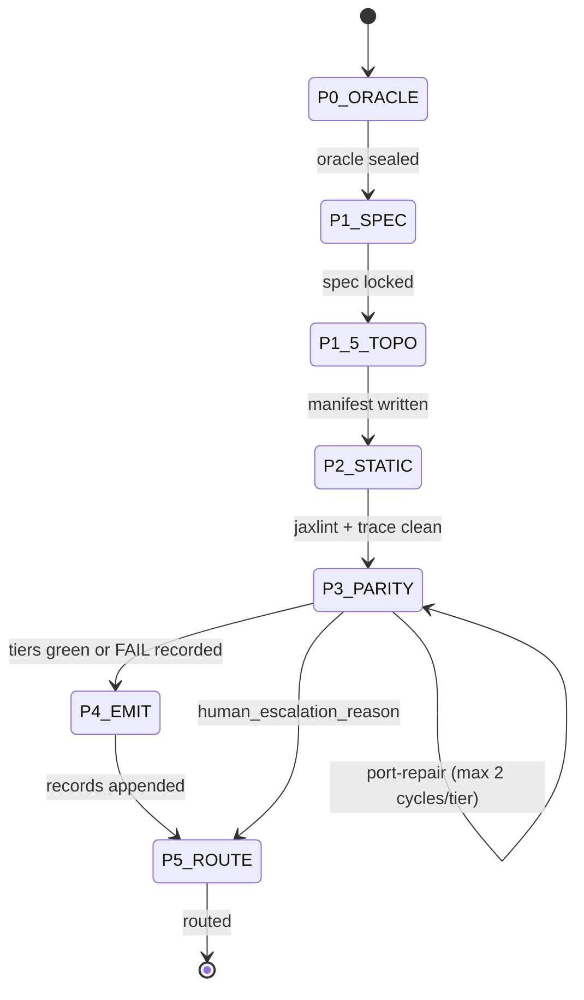

# Design: #2180 Implementation Validation Pipeline (MVP v0.1)

**Epic:** [#2180](backlog) — Implementation validation pipeline (jax-port + audit-fw integration)  
**Spec:** `.praxia/docs/specs/260618_hmw-design-unified-implementation-valida.md`  
**Architecture:** Faction C hybrid — `port/` owns oracle, parity, emit; production code lands **in-place** in `src/xtrax/` (no `port/jax_port/` staging).

## 1. Technical design

### 1.1 Problem and invariant

Extend the settled audit framework ([#1573](backlog)) with a **port_validation** vertical slice: sealed reference oracle, graded parity tiers (T1→T2→T3→[T4]→T5), static gates (jaxlint + chex trace-count), `domain=port` emit records, and a dedicated 7-step PCW template (6 gated phases + P1.5 artifact). Epic [#2181](backlog) (autoresearch) remains blocked until this MVP ships.

**Two-track invariant:** agents produce deterministic pytest/scripts; CI runs the same scripts with no LLM. Local and CI both invoke `just audit-port` on PRs touching `src/xtrax/` or `port/`.

**Current repo baseline (recon 2026-06-18):**

| Present | Absent |
|---------|--------|
| `just audit-foundation` (import-linter, `__future__` ratchet, jaxlint) | `port/` subtree |
| `scripts/audit_jaxlint_json.py` | `port_emit.py`, parity harness |
| `tests/audit/` N0 gates | `just audit-port`, CI audit jobs |
| `capability_registry.toml` v0.1.0 | `port_validation` PCW template |
| Wheel packages only `src/xtrax` via hatch | `audit.emit` N1.1 serializer ([#1577](backlog)) |

### 1.2 Repository layout

```
port/                              # dev-only — excluded from wheel
├── port_target.toml               # wave config: oracle_id, qualname, ad_critical
├── reference/                     # sealed oracle (reference-vendor write-only)
│   └── <kernel>/
│       ├── algo.py                # # REFERENCE: DO NOT MODIFY
│       └── baseline_io.json       # from oracle execution, not paper tables
├── tests/
│   ├── conftest.py                # tier ordering, T4 opt-in, emit hooks
│   └── test_parity_<kernel>.py    # imports from src/xtrax/
├── emit/
│   └── port_emit.py               # appends domain=port → .praxia/audits.jsonl
├── manifests/                     # P1.5 artifacts (not gates)
│   └── <wave_id>.toml
├── docs/
│   └── hook_schema_port_validation.md
└── bridge/                        # optional until Phase 2 (#2174)
    └── composition_map.toml       # qualname → composition node_id

src/xtrax/                         # in-place translation target (production)
└── <module>/                      # fixer writes here; parity tests import here

tests/
├── audit/                         # existing N0 foundation gates
└── contract/
    └── test_port_emit_schema.py   # local schema contract (parallel to #1577)

scripts/
├── audit_jaxlint_json.py          # existing — scoped by manifest in P2
└── audit_port_trace_count.py      # new — chex assert_max_traces

.praxia/
├── audits.jsonl                   # shared emit stream (dimension + port)
└── composition/
    └── capability_registry.toml   # bump to 0.2.0 for port identities

audit/
└── routing.toml                   # extend with domain=port rows (CC5 matrix)
```

#### Wheel vs dev extra

| Path | Wheel | `[project.optional-dependencies] dev` |
|------|-------|----------------------------------------|
| `src/xtrax/**` | ships | — |
| `port/reference/**` | excluded | required |
| `port/tests/**` | excluded | required |
| `port/emit/**` | excluded | importable via `PYTHONPATH=port` or hatch dev layout |

**`pyproject.toml` changes:**

- Add `chex>=0.1.86` to `dev` optional deps (trace-count gate).
- Confirm `[tool.hatch.build.targets.wheel] packages = ["src/xtrax"]` — no `port/` inclusion.
- Optional `[tool.port]` default path → `port/port_target.toml` for audit scripts.

#### `port_target.toml` schema

```toml
[port]
wave_id = "wave_001_example"           # resolves manifest → port/manifests/<wave_id>.toml
oracle_id = "ref:port/reference/<kernel>:v0.1.0:sha256:<content_hash>"
symbol_qualname = "xtrax.<module>.<fn>"
reference_subtree = "port/reference/<kernel>"

[capabilities]
stochastic = false                     # v0.1 MVP: no stateful PRNG ports
dynamic_shape = false                  # v0.1 MVP: no dynamic-shape padding

[parity]
ad_critical = false                    # default: skip T4
ad_critical_justification = ""         # required when ad_critical = true
tolerance_policy = "rtol=1e-4,atol=1e-4,matmul_precision=highest"
max_traces = 1                         # chex gate default (AC-5)
# tiers derived at runtime: T1→T2→T3→(T4 if ad_critical)→T5 — not editable in TOML

[access]
reference_write_identities = ["reference-vendor"]
fixer_read_only_on_reference = true
```

#### In-place translation

- **Rejected:** `port/jax_port/` staging (drift risk).
- **Accepted:** fixer translates directly into `src/xtrax/<module>/`.
- `port/tests/test_parity_*.py` imports production symbols from `src/xtrax/`.
- Merge blocked on tier gates, not directory promotion.

#### Bridge stub (Phase 2 prep)

`port/bridge/composition_map.toml` maps `symbol_qualname` → composition graph `node_id`. Empty or absent in v0.1; CI lint runs only when file is non-empty (qualnames ⊆ live `src/xtrax/` symbols).

---

### 1.3 PCW FSM: `port_validation`

New template — **not** `refactor_with_audit` or `spec_driven_dev`.

| Artifact | Path |
|----------|------|
| Source YAML | `agent_assets/workflows/port_validation.yaml` (create) |
| Emitted JS | `.claude/workflows/port-validation.js` (via `praxia dw emit`) |

#### Phase map

| Phase | ID | Gate? | Primary agents | Exit criteria |
|-------|-----|-------|----------------|---------------|
| P0 | ORACLE | yes | reference-vendor, recon | Sealed `port/reference/`, baseline I/O, `oracle_id` hash |
| P1 | SPEC | yes | specification-specialist | jaxtyping contracts; **paper results tables masked** |
| P1.5 | TOPO | no (artifact) | recon, planner | `port/manifests/<wave_id>.toml` — topo-sorted qualnames |
| P2 | STATIC | yes | jax-purity-reviewer | jaxlint clean + `chex.assert_max_traces` |
| P3 | PARITY | yes | test-designer, fixer (port) | T1→T2→T3→(T4)→T5 blocking pytest |
| P4 | EMIT | yes | graph-auditor / auditor | `port_emit.py` → `.praxia/audits.jsonl` per tier |
| P5 | ROUTE | yes | supervisor | CC5 severity×track → backlog / found-issues / block-CI |

**P1.5 is not a gate** — versioned manifest with `task_id`, `manifest_hash` (SHA-256 of canonical TOML), topo order. Canonical resolution: read `wave_id` from `port/port_target.toml` → load `port/manifests/<wave_id>.toml`. Phase 2 ([#2174](backlog)) entry checks manifest freshness ≤ port wave `task_id`.



#### Phase behaviors

**P0-ORACLE:** `reference-vendor` has exclusive write on `port/reference/`; all other identities read-only. Every reference file starts with `# REFERENCE: DO NOT MODIFY`. Baseline I/O from vendored oracle execution — never author-reported paper numbers.

**P1-SPEC:** specification-specialist context excludes paper results tables. Outputs jaxtyping contracts tied to oracle baselines plus a **math/pseudocode appendix** mapping oracle steps to contracts. Records `paper_mask_enforced: true` in wave manifest.

**P1.5-TOPO:** recon produces call-graph topo sort over wave-targeted `src/xtrax/` modules:

```toml
[manifest]
wave_id = "wave_001_example"
task_id = "260617_xtrax-composition-mission"
manifest_hash = "sha256:…"              # SHA-256 of canonical TOML bytes
created_at = "2026-06-18T00:00:00Z"
paper_mask_enforced = true

[[kernels]]
order = 1
qualname = "xtrax.transforms.map.apply_map"
module_path = "src/xtrax/transforms/map.py"
depends_on = []
```

**P2-STATIC:** Runs before P3 (preserves `error_taxonomy_class`). Failures → `compilation_leak`. jaxlint via existing `scripts/audit_jaxlint_json.py` scoped to manifest modules. Trace gate via `scripts/audit_port_trace_count.py`.

**P3-PARITY:** Blocking tier sequence in `port/tests/`. `conftest.py` enforces T1→T2→T3→(T4)→T5 via markers. T4 only when `ad_critical = true` with justification; `@pytest.mark.timeout(120)` per tier on CPU. `agentic_self_debug` capped at **2 cycles per tier FAIL** before `human_escalation_reason`.

**P4-EMIT:** Each tier completion calls `port_emit.emit_tier_verdict(...)`. Does **not** auto-route.

**P5-ROUTE:** Supervisor applies `audit/routing.toml` `domain=port` rows. Writes routing decision artifact to `.praxia/port/routing/<wave_id>_<finding_id>.toml`. Separated from P4 to prevent auto-tombstoning major findings.

#### PCW JS stub structure

Follow existing workflow emission patterns:

- `export const meta` with 7 phase entries (P1.5 labeled "Topo Manifest").
- `extractVerdict()` + `MAX_FIX_RETRIES = 2` for P3 repair loop.
- Hook validation in P3: compare `subagent-stop` payload vs pytest exit code + stdout hash.
- Budget: `{ maxRewinds: 6, maxCostUsd: 12.0 }`.

---

### 1.4 Emit integration ([#1577](backlog))

Port records are a **domain extension** of the N1.1 audit emit envelope, not a forked schema.

| Audit-fw field | Port record mapping |
|----------------|---------------------|
| `dim` | `"port"` (serialized as `domain: "port"`; **hash anchor uses `dim`**) |
| `symbol_qualname` | same |
| `rule_id` | `port_parity_tier` or `jaxlint` for P2-STATIC |
| `finding_id` | `hash(dim + qualname + rule_id + tolerance_policy)` per #1573 Q4; **`tolerance_policy` is N1.1 port-domain amendment** |
| `label` | `bug` on deterministic tier FAIL; `observation` on static WARN |
| `severity` | from `routing.toml` `domain=port` rows |
| `track` | `deterministic` always |

**Stub-first:** `port/emit/port_emit.py` ships now; delegates to `audit.emit` when [#1577](backlog) importable. Stub fields MUST be strict subset of N1.1 envelope.

#### Record shape (sketch)

```json
{
  "audit_id": "260618_port_example_t3",
  "task_id": "260617_xtrax-composition-mission",
  "domain": "port",
  "track": "deterministic",
  "finding_id": "sha256:port|xtrax.transforms.map.apply_map|parity_tier_3|rtol=1e-4,atol=1e-4",
  "symbol_qualname": "xtrax.transforms.map.apply_map",
  "rule_id": "parity_tier_3",
  "label": "bug",
  "severity": "major",
  "port_parity_tier": "tier_3",
  "oracle_id": "ref:port/reference/example:v0.1.0:sha256:…",
  "tier_verdict": {
    "status": "FAIL",
    "tolerance_policy": "rtol=1e-4,atol=1e-4,matmul_precision=highest",
    "error_taxonomy_class": "numeric_drift",
    "max_discrepancy": 0.0023
  },
  "evidence": {
    "pytest_nodeid": "port/tests/test_parity_example.py::test_tier_3",
    "traceback_excerpt": "…"
  },
  "routing": { "destination": null }
}
```

#### `port_emit.py` API

```python
def emit_tier_verdict(
    *,
    task_id: str,
    symbol_qualname: str,
    port_parity_tier: str,
    oracle_id: str,
    tier_verdict: TierVerdict,
    evidence: Evidence,
    audits_path: Path = Path(".praxia/audits.jsonl"),
) -> str:
    """Append one JSONL record; return finding_id."""

def _finding_id(
    dim: str, qualname: str, rule_id: str, tolerance_policy: str
) -> str: ...
```

**Delegation:** try `from audit.emit import append_finding` when [#1577](backlog) present; else local pydantic validation + append. **#1577 is soft dependency** — stub ships without it.

**N1.1 amendment:** Port domain adds `tolerance_policy` to `finding_id` hash inputs (base: `hash(dim + symbol_qualname + rule_id)` from spec 260611).

**Precedence vs dimension audits:** `port_validation` owns pre-merge gates on symbols in active `port/manifests/<wave_id>.toml`. Post-merge dimension sweeps re-emit only when no `domain=port` record exists for same `symbol_qualname + rule_id` within `task_id` window.

---

### 1.5 Hooks: `subagent-stop` extension

Formalized in capability registry 0.2.0 (`[hooks.subagent_stop.port_validation]`). **Normative flat payload** in spec Appendix A; wrapper metadata below is optional transport only.

**Optional wrapper** (PCW transport — walker ignores outer keys):

```json
{
  "hook": "subagent-stop",
  "workflow": "port_validation",
  "phase": "P3-PARITY",
  "payload": {
    "tier_verdict": "PASS",
    "port_parity_tier": "tier_3",
    "oracle_id": "ref:port/reference/<kernel>:v0.1.0:sha256:…",
    "pytest_nodeid": "port/tests/test_parity_<kernel>.py::test_tier_3",
    "pytest_exit_code": 0,
    "stdout_sha256": "<sha256 of UTF-8 normalized pytest summary line>"
  }
}
```

**Normative payload** (Appendix A — walker validates this object):

```json
{
  "tier_verdict": "PASS|FAIL",
  "port_parity_tier": "tier_3",
  "oracle_id": "ref:port/reference/<kernel>:v0.1.0:sha256:…",
  "pytest_nodeid": "port/tests/test_parity_<kernel>.py::test_tier_3",
  "pytest_exit_code": 0,
  "stdout_sha256": "<sha256 of UTF-8 normalized pytest summary line>"
}
```

Dispatch **FAIL** when any of:

1. `tier_verdict == "PASS"` but `pytest_exit_code != 0`
2. `stdout_sha256` mismatch (hash input: final line matching `PASSED|FAILED` for `pytest_nodeid`)
3. `oracle_id` ≠ `port_target.toml` lock
4. Hook claims PASS but emit record says FAIL (cross-check in P4)

Supervisor **aggregates** hook payloads; does **not** originate tier verdicts.

---

### 1.6 Parity harness (T1–T3 + T5 MVP)

| Tier | Marker | Gate | Default MVP |
|------|--------|------|-------------|
| T1 | `tier_1` | dtype/shape vs oracle | yes |
| T2 | `tier_2` | float64 grounding | yes |
| T3 | `tier_3` | float32 convergence | yes |
| T4 | `tier_4` | gradient parity | only if `ad_critical` |
| T5 | `tier_5` | JIT invariance | yes |

`port/tests/conftest.py`:

- `pytest_collection_modifyitems` — order tiers T1→T2→T3→(T4)→T5.
- Skip T4 when `ad_critical = false`.
- Fixture `port_target` loads `port/port_target.toml`.
- Fixture `oracle` imports from `port/reference/` (tests only).
- On tier completion, prepare hook payload for walker verification.

**First kernel candidate:** topo-sorted leaf in `src/xtrax/transforms/` or `src/xtrax/sparse/` with vendorable reference (no PRNG, no dynamic-shape padding in v0.1).

---

### 1.7 CI matrix

#### `just audit-port` recipe

```make
audit-port: audit-port-oracle-seal audit-port-static audit-port-parity audit-port-emit-contract

audit-port-oracle-seal:
    uv run python scripts/audit_port_oracle_seal.py --target port/port_target.toml

audit-port-static:
    uv run python scripts/audit_jaxlint_json.py --paths-from port/port_target.toml
    uv run python scripts/audit_port_trace_count.py

audit-port-parity:
    uv run pytest port/tests/ -v --tb=short

audit-port-emit-contract:
    uv run pytest tests/contract/test_port_emit_schema.py -v
    # when audit.emit importable: also run tests/contract/test_audit_emit_envelope.py (AC-9 dual validation)
```

`audit-port` composes N0 foundation checks where applicable; full local run: `just audit-foundation && just audit-port`.

#### GitHub Actions jobs

| Job | Trigger | Install | Commands |
|-----|---------|---------|----------|
| `lint-format-type-test` | all PRs | `uv sync --extra dev` | existing (unchanged) |
| `audit-foundation` | all PRs | `uv sync --extra dev` | `just audit-foundation` |
| **`audit-port`** | PR touches `src/xtrax/**` or `port/**` | `uv sync --extra dev` | `just audit-port` |
| `wheel-smoke` | release tag | `uv sync` (no dev) | build wheel; assert `port/` absent |
| `bridge-lint` | PR touches non-empty `port/bridge/composition_map.toml` | dev | qualname validation script |

**Path filter for `audit-port`:**

```yaml
paths:
  - 'src/xtrax/**'
  - 'port/**'
  - 'tests/contract/test_port_emit_schema.py'
  - 'scripts/audit_port_trace_count.py'
  - 'Justfile'
```

#### Pre-mortem mitigations

| Risk | Mitigation |
|------|------------|
| Dev-extra install gap | `audit-port` job on path-filtered PRs with `--extra dev` |
| Emit stub rot | Contract test + delegate to [#1577](backlog) when present; dual validation in CI |
| Hook ignored | Walker FAIL on PASS + non-zero exit / hash mismatch |
| T4 CI cost | `ad_critical` default false + justification required + timeout marker |
| Oracle seal breach | `reference-vendor` exclusive write; fixer read-only |
| Bridge drift | Optional until Phase 2; lint when non-empty |
| Manifest staleness | `manifest_hash` + `task_id`; WARN at P2, FAIL at Phase 2 entry |

---

## 2. Child backlog DAG

Parallelizable work items for epic **#2180**. Internal dependencies use **descriptive slugs** (not provisional child IDs). External epic dependency: **1573** (audit-fw foundation). **1577** is soft — opportunistic delegation only.

### 2.1 Wave diagram

```
Wave 1 — mechanical MVP (max parallel after scaffold)
├── port-scaffold
├── port-emit-stub ───────────── depends [port-scaffold]  (#1577 delegation optional)
├── port-static-trace-gate ───── depends [port-scaffold]
├── port-parity-harness ──────── depends [port-scaffold, port-emit-stub]
└── audit-port-ci ────────────── depends [1573, port-scaffold, port-emit-stub,
                                              port-static-trace-gate, port-parity-harness]

Wave 1 MVP AC subset (mechanical gates — PCW/orchestration deferred to Wave 2):
  AC-1, AC-2, AC-3, AC-4, AC-5, AC-6, AC-8, AC-9, AC-11
  Deferred Wave 2: AC-7 (hook immutable judge), AC-10 (P1-SPEC paper mask + pseudocode),
                   AC-12 (P5-ROUTE routing artifact + bridge lint)

Wave 2 — orchestration + routing
├── port-hook-schema ─────────── depends [port-emit-stub]
├── port-routing-domain-rows ─── depends [1573, port-emit-stub]
├── capability-registry-port-identities depends [port-hook-schema]
└── port-validation-pcw-template depends [port-hook-schema,
                                            capability-registry-port-identities,
                                            port-parity-harness]

Wave 3 — Phase 2 prep (optional in v0.1)
└── composition-bridge-stub ──── depends [port-scaffold]
```

---

### 2.2 Child items

#### port-scaffold

| Field | Value |
|-------|-------|
| **title** | Scaffold port/ dev-only subtree and port_target.toml template |
| **description** | Create `port/reference/`, `port/tests/`, `port/emit/`, `port/manifests/`, `port/docs/` with README and sealed-reference conventions (`# REFERENCE: DO NOT MODIFY`). Add `port/port_target.toml` template with `wave_id`, `ad_critical`, `oracle_id`, `symbol_qualname`, `max_traces`, and `[capabilities] stochastic=false`, `dynamic_shape=false`. Confirm `pyproject.toml` keeps `port/` out of wheel; document dev-extra install for port gates. |
| **priority** | P1 |
| **category** | infrastructure |
| **difficulty** | quick |
| **depends_on** | [] |
| **parent_id** | 2180 |
| **workflow_hint** | bugfix_simple |
| **wave** | 1 |

---

#### port-emit-stub

| Field | Value |
|-------|-------|
| **title** | Implement port_emit.py stub and emit contract test |
| **description** | Ship `port/emit/port_emit.py` appending `domain=port` records to `.praxia/audits.jsonl` with pydantic validation against sketch schema. `finding_id = hash(dim + qualname + rule_id + tolerance_policy)` per #1573 + N1.1 port amendment. Add `tests/contract/test_port_emit_schema.py`. Feature-detect `audit.emit` from [#1577](backlog) and delegate when importable (soft — not a DAG blocker); stub fields strict subset of N1.1 envelope. |
| **priority** | P1 |
| **category** | feature |
| **difficulty** | standard |
| **depends_on** | [port-scaffold] |
| **parent_id** | 2180 |
| **workflow_hint** | port_validation |
| **wave** | 1 |

---

#### port-static-trace-gate

| Field | Value |
|-------|-------|
| **title** | Add chex assert_max_traces gate for ported modules (P2-STATIC) |
| **description** | Implement `scripts/audit_port_trace_count.py` reading manifest qualnames and asserting bounded JIT recompilations via `chex.assert_max_traces`. Add `chex` to dev optional deps and `tests/audit/test_port_trace_count.py`. Failures map to `error_taxonomy_class: compilation_leak` for emit integration. |
| **priority** | P1 |
| **category** | feature |
| **difficulty** | standard |
| **depends_on** | [port-scaffold] |
| **parent_id** | 2180 |
| **workflow_hint** | refactor_with_audit |
| **wave** | 1 |

---

#### port-parity-harness

| Field | Value |
|-------|-------|
| **title** | Build graded parity harness with T1-T3+T5 blocking tiers |
| **description** | Implement `port/tests/conftest.py` with blocking tier ordering, T4 skip unless `ad_critical`, and pytest markers per tier. Add first `test_parity_<kernel>.py` importing from `src/xtrax/` against vendored oracle baseline I/O. Wire tier completion to call `port_emit.emit_tier_verdict`. Include P1.5 manifest shape in `port/manifests/<wave_id>.toml`. |
| **priority** | P1 |
| **category** | feature |
| **difficulty** | extended |
| **depends_on** | [port-scaffold, port-emit-stub] |
| **parent_id** | 2180 |
| **workflow_hint** | port_validation |
| **wave** | 1 |

---

#### audit-port-ci

| Field | Value |
|-------|-------|
| **title** | Wire just audit-port recipe and path-filtered CI job |
| **description** | Add `audit-port-oracle-seal`, `audit-port`, `audit-port-static`, `audit-port-parity`, and `audit-port-emit-contract` recipes to Justfile. Manifest resolution via `port/port_target.toml` `wave_id` → `port/manifests/<wave_id>.toml`. Emit-contract runs dual validation when `audit.emit` importable (AC-9). Add `audit-foundation` and `audit-port` GitHub Actions jobs; path filters on `src/xtrax/**` and `port/**` using `uv sync --extra dev`. Add `wheel-smoke` asserting `port/` absent from release wheel. |
| **priority** | P1 |
| **category** | infrastructure |
| **difficulty** | standard |
| **depends_on** | [1573, port-scaffold, port-emit-stub, port-static-trace-gate, port-parity-harness] |
| **parent_id** | 2180 |
| **workflow_hint** | bugfix_simple |
| **wave** | 1 |

---

#### port-hook-schema

| Field | Value |
|-------|-------|
| **title** | Document subagent-stop tier_verdict hook schema for port_validation |
| **description** | Author `port/docs/hook_schema_port_validation.md` with JSON schema per spec Appendix A, stdout hash algorithm, and PCW walker FAIL conditions. Include worked examples for PASS and FAIL parity subagent completions. Contract for immutable judge enforcement before PCW JS lands. |
| **priority** | P1 |
| **category** | documentation |
| **difficulty** | quick |
| **depends_on** | [port-emit-stub] |
| **parent_id** | 2180 |
| **workflow_hint** | port_validation |
| **wave** | 2 |

---

#### port-routing-domain-rows

| Field | Value |
|-------|-------|
| **title** | Propose audit/routing.toml domain=port severity rows |
| **description** | Extend `audit/routing.toml` CC5 matrix with `domain=port` rows mapping tier FAIL / static WARN to severity and routing destination (`block_ci`, `backlog_node`, `found_issues`). P5-ROUTE writes `.praxia/port/routing/<wave_id>_<finding_id>.toml`. Interim defaults: `major` on tier FAIL, `minor` on static WARN, `track=deterministic`. Coordinate review with audit-fw maintainer per [#1573](backlog). |
| **priority** | P1 |
| **category** | infrastructure |
| **difficulty** | quick |
| **depends_on** | [1573, port-emit-stub] |
| **parent_id** | 2180 |
| **workflow_hint** | refactor_with_audit |
| **wave** | 2 |

---

#### capability-registry-port-identities

| Field | Value |
|-------|-------|
| **title** | Bump capability registry to 0.2.0 with port identities |
| **description** | Add `reference-vendor`, `specification-specialist`, and `test-designer` identities to `.praxia/composition/capability_registry.toml` at semver 0.2.0. Register `[hooks.subagent_stop.port_validation]` pointing at hook schema doc. Extend `scripts/load_capability_registry.py` validation and `tests/composition/test_capability_registry.py` coverage. |
| **priority** | P1 |
| **category** | infrastructure |
| **difficulty** | standard |
| **depends_on** | [port-hook-schema] |
| **parent_id** | 2180 |
| **workflow_hint** | refactor_with_audit |
| **wave** | 2 |

---

#### port-validation-pcw-template

| Field | Value |
|-------|-------|
| **title** | Create port_validation PCW template YAML and emitted JS stub |
| **description** | Author `agent_assets/workflows/port_validation.yaml` with 7-step FSM (P0–P5 incl. P1.5-TOPO artifact) and emit via `praxia dw emit`. Generated `.claude/workflows/port-validation.js` includes hook validation, P3 repair loop (max 2), and phase-gated agent dispatches per identity roster. Stub prompts acceptable for v0.1; gate on structure and routing. |
| **priority** | P1 |
| **category** | feature |
| **difficulty** | extended |
| **depends_on** | [port-hook-schema, capability-registry-port-identities, port-parity-harness] |
| **parent_id** | 2180 |
| **workflow_hint** | port_validation |
| **wave** | 2 |

---

#### composition-bridge-stub

| Field | Value |
|-------|-------|
| **title** | Scaffold optional port/bridge/composition_map.toml with CI lint |
| **description** | Add empty `port/bridge/composition_map.toml` with schema comments mapping `symbol_qualname` to composition `node_id`. Implement opt-in CI lint validating qualnames ⊆ live `src/xtrax/` symbols when file is non-empty. No gate in v0.1 MVP; binding deferred until [#2174](backlog) Phase 2. |
| **priority** | P2 |
| **category** | infrastructure |
| **difficulty** | quick |
| **depends_on** | [port-scaffold] |
| **parent_id** | 2180 |
| **workflow_hint** | port_validation |
| **wave** | 3 |

---

### 2.3 Acceptance mapping

| AC | Child slugs |
|----|-------------|
| AC-1 Sealed oracle | port-scaffold, port-parity-harness |
| AC-2 In-place translation | port-scaffold, port-parity-harness |
| AC-3 Graded T1-T3+T5 | port-parity-harness |
| AC-4 T4 opt-in | port-scaffold, port-parity-harness |
| AC-5 Static + trace gates | port-static-trace-gate |
| AC-6 Port emit | port-emit-stub |
| AC-7 Hook immutable judge | port-hook-schema, port-validation-pcw-template |
| AC-8 CI audit-port | audit-port-ci |
| AC-9 N1.1 envelope | port-emit-stub |
| AC-10 Paper info isolation | port-validation-pcw-template |
| AC-11 P1.5 manifest | port-parity-harness |
| AC-12 P5-ROUTE + bridge lint | port-routing-domain-rows, composition-bridge-stub |

---

## 3. Open TBDs

- **routing.toml ownership:** port-routing-domain-rows proposes rows; audit-fw maintainer reviews.
- **First kernel selection:** planner picks leaf from recon topo map during first port wave dispatch.
- **Hypothesis metamorphic fuzz:** deferred post-first-port-wave (v0.2 backlog).
- **jax-port skill xtrax variant doc:** tech-debt after MVP scaffold.

---

## 4. References

- Spec: `.praxia/docs/specs/260618_hmw-design-unified-implementation-valida.md`
- Research: `.praxia/research/research_note_2180_port_validation.md`
- Audit-fw: epic [#1573](backlog), emit envelope [#1577](backlog)
- Blocks: [#2181](backlog) autoresearch; enables [#2174](backlog) Phase 2 via bridge
