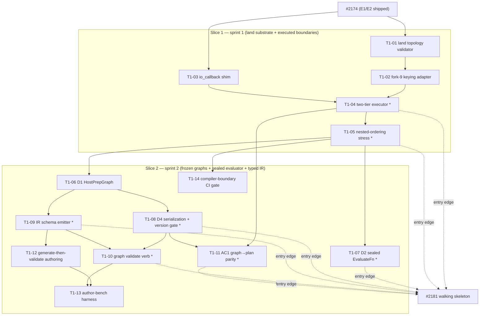

# DAG T1 — #2174 minimal composition substrate + typed composition IR node

> **Enum normalization (praxia backlog).** priority ∈ {P1,P2,P3}, difficulty ∈ {quick,moderate,involved}.
> Mapping applied across all three DAG docs: priority critical/P0→P1, high→P2, medium→P2, low→P3;
> difficulty XS/S→quick, M→moderate, L/XL→involved. (T1 items were already authored in the normalized enums.)

## Thread summary

The winner is the **executor-first minimal-breakage substrate**: convert the declared-never-executed
Fuse/Tap/Sink surface into real behavior with the least churn, then layer the typed composition IR on
top. Fork verdicts are locked (spec decision log): (9) a **name-keying adapter at the executor entry**
adapts `RunSpec.boundaries: list[AxisBoundary]` to the `Mapping[str, AxisBoundary]` the landed
`validate_plan_topology` expects — the type does **not** break, aminx subclasses stay intact; (10) a
**two-tier executor** — ordered Tap/Sink execute *inside* the Vmap/SafeMap/Scan bodies (per-step,
JEP-10657 token threaded), while Fuse reductions run at the **run layer** over the assembled region,
and per-step-carry Fuse is out of scope and rejected loudly; (11) the **EvaluateFn Protocol + seal**
lives in xtrax core beside Engine (a compiler-boundary-clean type contract), with the concrete fitness
registry a documented extension seam, not a published sibling package; (12) **generate-then-validate is
the default** authoring front-end, constrained decoding stays a smoke demo, and the choice is gated
behind an empirical `graph author-bench`; (13) the **IR JSON Schema is emitted from E1 types** as the
single source of truth (one schema, two consumers: chain-map read-only + the #2181 loop). The work is
decomposed into **two sprint-sized slices**: **Slice 1** lands the in-flight topology validator + the
fork-9 adapter + the D3 two-tier executed boundaries + the `io_callback` shim; **Slice 2** adds the D1
frozen host-prep graphs, the D2 sealed EvaluateFn seam, the D4 metadata/serialization round-trip, and
the typed-IR node (schema emitter, `graph validate` verb, generate-then-validate authoring, benchmark).
The substrate's deterministic validation-gate artifacts are the **entry edge for #2181**.

## Slice → item map

| Slice | Sprint | Items | Deliverables |
|---|---|---|---|
| **Slice 1** | sprint 1 | T1-01 … T1-05 | S1 land `topology.py` + fork-9 adapter; D3 two-tier executed boundaries; O1 `io_callback` shim |
| **Slice 2** | sprint 2 | T1-06 … T1-14 | D1 HostPrepGraph; D2 sealed EvaluateFn; D4 serialization/metadata; IR emitter + `graph validate` + authoring + benchmark |

Slice 2 is **sprint-sequenced behind Slice 1**: its `depends_on` edges route through the Slice-1 exit
milestone **T1-05** (the executed-boundary certification), even where an item has no hard data edge into
Slice 1. This is the sprint gate, encoded as backlog `depends_on` so the scheduler will not start Slice 2
until Slice 1 lands.

---

## Backlog items

### T1-01 — Land the in-flight topology validator as-is (test-green)
- workspace: xtrax
- category: feature
- priority: P1, difficulty: quick
- depends_on: [#2174]
- acs_covered: [AC4 (validator half — ordered-on-Vmap rejection, already tested)]
- gate: `uv run pytest tests/stages/test_topology.py` exits 0 with **zero** collection errors and zero
  failures; `uv run python -c "from xtrax.stages.topology import validate_plan_topology, PlanTopologyError"`
  succeeds. Fast/loud: any test failure or import error blocks the merge (exit 1); no `xfail`/`skip`
  markers permitted on the topology suite.
- description: Commit the uncommitted, test-green `src/xtrax/stages/topology.py` + `tests/stages/test_topology.py`
  from the main checkout **without redesign**. `validate_plan_topology(decisions, Mapping[str, AxisBoundary])`
  is structural/duck-typed (matches `type(strategy).__name__`, not isinstance) and enforces two pre-trace
  rules: no-Scan-on-heterogeneous-axis (`PlanTopologyError`) and no-ordered-Tap/Sink-on-Vmap. This is the
  S1 opener; it unblocks the fork-9 adapter and the executed boundaries. Do not add producers or change the
  duck-typed contract in this item — landing it as-is is the whole scope.

### T1-02 — Fork-9 name-keying adapter at executor entry (total + injective)
- workspace: xtrax
- category: infrastructure
- priority: P1, difficulty: quick
- depends_on: [T1-01]
- acs_covered: [AC-adapter-injectivity (PM4)]
- gate: an adapter `list[AxisBoundary] -> Mapping[str, AxisBoundary]` keyed by axis name; unit test asserts
  the mapping is **total** (every input boundary appears) and **injective** (a duplicate axis name raises
  `ValueError`/`PlanTopologyError`, never silently dedups or drops). Fast/loud: duplicate-axis-name input
  raises a named error at adaptation time (exit 1 in the test); `RunSpec.boundaries` stays
  `list[AxisBoundary] | None` (a type check confirms the field is unchanged, so aminx positional
  construction is not broken).
- description: Add the name-keying adapter that converts `RunSpec.boundaries` (a list) to the axis-name-keyed
  `Mapping` the landed `validate_plan_topology` consumes, at the executor entry — the most reversible fork-9
  resolution. Per PM4, the adapter must **raise on duplicate axis-name collision** rather than mask a real
  keying bug (a silent dedup would hand the validator a Mapping missing an entry it should have rejected).
  Include the totality/injectivity AC. Leave the break-to-`Mapping` type migration as a deferred cleanup.

### T1-03 — Vendored `io_callback` shim with import-time signature assert
- workspace: xtrax
- category: infrastructure
- priority: P1, difficulty: quick
- depends_on: [#2174]
- acs_covered: [AC-shim-import-assert (PM5)]
- gate: `xtrax.stages._callback` wraps `jax.experimental.io_callback` and asserts the expected signature at
  **module import time** (not first call); importing the module under a jax outside the pinned range raises
  `ImportError`/`AssertionError` loudly. A CI job fails (exit 1) if the resolved jax version leaves the
  pinned lockfile range. Fast/loud: signature drift surfaces as an import-time exception, never an opaque
  runtime traceback inside the loop.
- description: Introduce the thin vendored shim (O1) so an upstream move in the still-experimental
  `jax.experimental.io_callback` namespace is a one-file change. Pin jax in the lockfile and assert the
  shim's expected `io_callback` signature at import. Per PM5, the assert must fire at import (a
  runtime-only assert rotted silently), and a CI job must enforce the jax pin range. All reference Tap/Sink
  implementations (T1-04) import `io_callback` through this shim, never directly.

### T1-04 — Two-tier boundary executor: ordered Tap/Sink inside tiling iterators + run-layer Fuse
- workspace: xtrax
- category: feature
- priority: P1, difficulty: involved
- depends_on: [T1-02, T1-03]
- acs_covered: [AC4, AC1 (executed-boundary path)]
- gate: reference Sink writes host records from inside jit via the shim; a counter-test asserts step order
  is preserved under `ordered=True` on **SafeMap and Scan**; `ordered=True` on **Vmap** is rejected by
  `validate_plan_topology` (`PlanTopologyError`). Per-step-carry Fuse (reducing over a scan carry never
  stacked into ys) is rejected **loudly** by `validate_plan_topology`, not silently mis-reduced. Fast/loud:
  an out-of-order record OR a missing rejection fails the test (exit 1). **Certification note:** AC4 on a
  flat scan is *necessary-not-sufficient* — D3 is not certified complete until the nested stress harness
  (T1-05) is green.
- description: Build the executor that actually invokes AxisBoundary ops (fork-10 two-tier decomposition):
  ordered Tap (`T -> T`) and Sink (`T -> None`) fire **per-step inside** the Vmap/SafeMap/Scan bodies with
  the JEP-10657 token threaded (a run-layer wrapper physically cannot deliver per-step order — it only sees
  stacked ys); Fuse (`S -> Out`) reductions run at the **run layer** over the assembled tiled region. Uses
  the T1-02 adapter for axis-name keying and the T1-03 shim for `io_callback`. This is the declared-never-
  executed antidote and the highest-leverage single slice for both epics.
  **Entry criterion for #2181 walking skeleton** (executed boundaries — certified by T1-05).

### T1-05 — Nested-ordering stress harness (PM1 certification of the executor)
- workspace: xtrax
- category: testing
- priority: P1, difficulty: moderate
- depends_on: [T1-04]
- acs_covered: [AC4-nested (PM1)]
- gate: ordering is preserved under **vmap-of-scan AND scan-of-scan** nesting, run **under jit with
  reorder / buffer-donation stress**, repeated **N** iterations; the harness fails loud on the **FIRST**
  out-of-order record (exit 1), asserting deterministic order on every one of the N runs. Fast/loud: a
  single non-deterministic reorder anywhere in N iterations fails the gate — no flakiness tolerance,
  no averaging.
- description: The PM1 mitigation, elevated to its own trackable node because it is the top failure by
  expected damage (silent, at-scale, corrupts every recorded fitness run's provenance). The runner-up's
  warning was that ordered Tap/Sink can look correct on a toy flat scan yet reorder under XLA's latitude
  on a vmap-of-scan path with incomplete token threading. This harness closes that gap: nested tiling,
  jit reorder/donation stress, N repetitions, fail-on-first-out-of-order. Slice-1 exit milestone — Slice 2
  is sprint-gated behind this item.
  **Entry criterion for #2181 walking skeleton** (certifies the executed-boundaries edge; PM1 provenance).

### T1-06 — D1 HostPrepGraph data model (typed pre-JIT nodes + frozen/mutable flag)
- workspace: xtrax
- category: feature
- priority: P1, difficulty: moderate
- depends_on: [T1-05]
- acs_covered: [AC2]
- gate: a typed pre-JIT node model (callable ref + `node_metadata` slots enforced from
  `node_metadata_schema.toml`, required `nl_description`) + edges + a **per-node frozen/mutable flag**;
  mutating a frozen node raises **before any trace begins**. Fast/loud: mutation of a frozen node raises a
  named error (e.g. `FrozenNodeError`) at mutation time; the failure mode being guarded against is
  "mutation silently permitted." Keep the `bathos_sidecar_ref` metadata **slot** but do not code-enforce
  binding (O2 deferral).
- description: The D1 host-prep graph node model — the compile-time substrate the IR serializes and the
  #2181 evolve-block mutation boundary maps onto. Nodes carry a frozen/mutable flag (the EVOLVE-BLOCK
  analog): frozen nodes reject mutation pre-trace. Metadata slots derive from `node_metadata_schema.toml`
  with `nl_description` required. This is compiler-boundary-clean (no UI identifiers). It is the foundation
  D4 serialization (T1-08) and the IR emitter (T1-09) build on.

### T1-07 — D2 sealed EvaluateFn seam in core (registration-locked) — ENTRY EDGE #2181
- workspace: xtrax
- category: feature
- priority: P1, difficulty: moderate
- depends_on: [T1-05]
- acs_covered: [AC3]
- gate: a sealed evaluator with fixed signature `(frozen_context, candidate) -> dict[str, float]`; a
  **second registration raises** (e.g. `EvaluatorAlreadySealedError`); the module exposes **no mutation
  API**; a **synthetic one-hot ground-truth sanity check passes** (BATHOS measurement-verification rule —
  feed a known-best candidate, assert the fitness dict scores it top). Fast/loud: re-registration
  succeeding, any mutation entry point existing, or the one-hot check mis-scoring all fail the test (exit 1).
- description: The greenfield third leg of the mutation triad (§1.2) — the immutable fitness oracle xtrax
  has no primitive for today. Per fork-11, the `(frozen_context, candidate) -> dict[str, float]` **Protocol
  type + seal/registration-lock semantics live in xtrax core** (beside Engine, e.g. `xtrax.stages.evaluate`)
  because they are compiler-boundary-clean type contracts and AC3's one-hot sanity check needs a concrete
  sealed object to test in core. The concrete fitness registry + any #2181 population coupling is a
  **documented extension seam**, not a published sibling package this sprint.
  **Entry criterion for #2181 walking skeleton** (sealed evaluator monopoly — fitness scalars come only
  from this seam).

### T1-08 — D4 graph serialization + metadata round-trip + schema-version load gate — ENTRY EDGE #2181
- workspace: xtrax
- category: feature
- priority: P1, difficulty: moderate
- depends_on: [T1-06]
- acs_covered: [AC5, AC5-version-gate (PM3)]
- gate: (AC5) a graph round-trip (serialize → deserialize) preserves node metadata exactly; a missing
  `nl_description` fails validation. (AC5-version-gate) loading a graph whose `schema_version` is **unknown
  or older-than-minimum raises loudly** — **no silent default-fill of required fields**. Fast/loud: a lossy
  round-trip, an accepted missing description, or a tolerated stale/unknown `schema_version` fails the test
  (exit 1) with a named error (e.g. `SchemaVersionError`).
- description: Serialize the D1 HostPrepGraph to TOML/JSON and back with `schema_version` discipline
  (manifest.py pattern). Per PM3, `schema_version` must be **checked on load**, not merely emitted — the
  failure that shipped in the autopsy was a loader that tolerated a missing field with a default instead of
  failing, silently changing the meaning of old #2181 lineage graphs. The version-gate AC hardens this:
  required fields never default-fill; unknown/older schema versions raise. This is half of the
  "graph serialization/CLI" **entry criterion for #2181 walking skeleton**.

### T1-09 — IR schema emitter from E1 types (single source of truth) — ENTRY EDGE #2181
- workspace: xtrax
- category: feature
- priority: P1, difficulty: moderate
- depends_on: [T1-06]
- acs_covered: []  # NS-slice deliverable; emission side of the version-gate — load-side AC5-version-gate is covered by T1-08
- gate: an emitter dumps the composition IR **JSON Schema v0.1** derived from E1 types (`BundleSchema` +
  `AxisSpec`/`AxisOverride` + the closed Fuse/Tap/Sink/AxisBoundary vocabulary + `node_metadata` slots)
  carrying a `schema_version`. A drift test asserts the emitted schema stays consistent with the E1 types
  it derives from (an added/removed E1 field the emitter ignores fails the test). Fast/loud: schema/E1
  drift or a missing `schema_version` fails the emit test (exit 1); the emitter is the **single** schema
  source — no parallel hand-authored schema is permitted (grep gate for a second schema definition).
- description: Emit the typed composition IR schema from the real E1 types as the single source of truth
  (fork-13), rejecting a standalone shared package precisely because that creates two competing graph
  formats. Deliberate coupling to real types is the feature (derived-from, not parallel-to). One schema,
  two consumers: chain-map (read-only, later) and the #2181 loop. This is the "IR" the deterministic
  validation gate (T1-10) checks against — **entry criterion for #2181 walking skeleton**.

### T1-10 — `graph validate` CLI verb writing audit_verdict — ENTRY EDGE #2181
- workspace: xtrax
- category: feature
- priority: P1, difficulty: moderate
- depends_on: [T1-08, T1-09]
- acs_covered: []  # NS-slice deliverable; gate derives from mandate §3.3 / synthesis §3.3 — flagged as spec-traceability gap, candidate spec amendment
- gate: `xtrax graph validate <ir.json>` loads an IR document, runs `extract_schema`/eval_shape-consistency
  + `validate_plan_topology` (+ jaxlint JL-series), and writes `audit_verdict` ∈ {PASS, FAIL, NEEDS_WORK}
  into node metadata. Success metric: all three checks pass → `audit_verdict=PASS`, verb exits 0. Fast/loud:
  any failing check → `audit_verdict=FAIL`/`NEEDS_WORK` written, verb **exits 1** with a structured JSON
  envelope (`schema_version`, `failure_count`, `failures[]`) that **names the failing check** — never a
  silent skip-on-drift.
- description: The deterministic validation-gate verb — the concrete artifact the roadmap designates as the
  **#2181 entry edge**. It chains the cheap deterministic verifiers (`extract_schema` + `validate_plan_topology`
  + jaxlint) into one PASS/FAIL/NEEDS_WORK verdict emitted to the existing `audit_verdict` slot (~80% of the
  machinery exists). This is the non-optional post-generation verifier that makes constrained/free graph
  authoring safe. **Entry criterion for #2181 walking skeleton** (the schema-JSON info barrier + deterministic
  fitness-substrate verdict).

### T1-11 — AC1 graph→plan parity through the CLI (integration capstone) — ENTRY EDGE #2181
- workspace: xtrax
- category: testing
- priority: P1, difficulty: moderate
- depends_on: [T1-04, T1-08]
- acs_covered: [AC1]
- gate: a **2-node host-prep graph + 1 traced fn**, serialized and consumed via the CLI, produces a
  `BatchPlan` **identical** to direct `infer_bundle`. Success metric: byte/structure-equal BatchPlan.
  Fast/loud: **any** BatchPlan divergence fails loud (exit 1) — the assertion is exact equality, not
  approximate.
- description: The integration capstone proving the whole executed-substrate path — graph → serialize →
  CLI consume → executed boundaries → BatchPlan — matches the direct `infer_bundle` ground truth with zero
  divergence. Depends on the executor (T1-04) and serialization (T1-08). Completes the "executed boundaries
  + graph serialization/CLI" **entry criterion for #2181 walking skeleton**.

### T1-12 — Generate-then-validate authoring front-end + Outlines constrained-decoding smoke demo
- workspace: xtrax
- category: feature
- priority: P2, difficulty: moderate
- depends_on: [T1-09]
- acs_covered: []  # NS first-slice deliverable (research §3.3c)
- gate: the **default** authoring path free-generates a candidate IR document and validates it via
  `graph validate` (T1-10); a separate **smoke** path feeds the same JSON schema to Outlines to constrained-
  decode one valid graph. Success metric: generate-then-validate authors ≥1 graph passing `graph validate`;
  the Outlines smoke produces schema-valid JSON. Fast/loud: constrained decoding stays a **smoke demo
  only** — it is not wired into any loop this sprint; a test asserts no loop code imports the constrained
  path as a hard dependency.
- description: Implement generate-then-validate as the **default** front-end (fork-12), keeping Outlines
  constrained decoding as a smoke demo pending the benchmark verdict. Reversible by construction: the IR
  schema (T1-09) is identical whether you constrained-decode into it or free-generate-then-validate against
  it — same schema, swappable front-end. Proves the NS loop (generate → deterministically verify → record
  verdict) without touching chain-map UI or #2181 loop mechanisms.

### T1-13 — `graph author-bench` harness (faithfulness + validity yield, gates fork-12)
- workspace: xtrax
- category: research
- priority: P2, difficulty: involved
- depends_on: [T1-12, T1-10]
- acs_covered: [AC-benchmark (PM2)]
- gate: over **~10 authoring tasks**, the harness reports an **ABSOLUTE ground-truth faithfulness rate**
  AND a **structural-validity yield** (both against ground truth), plus a small human-labeled faithfulness
  spot-check. Success metric: both absolute numbers are produced and recorded. Fast/loud: the benchmark
  **FAILS (exit 1) if only a mode-vs-mode degradation delta is produced** — the faithfulness spot-check is
  a HARD sub-gate with its own metric, not a nice-to-have. (PM2: a delta-only benchmark reports "no
  degradation" even when both modes are 40% wrong.)
- gate (fork-12 decision rule — **PROVISIONAL DEFAULTS, revisable at benchmark design review**):
  constrained decoding is adopted **only if** structural-validity yield improves **≥ +10pp** over
  generate-then-validate **AND** absolute faithfulness is non-inferior (margin **5pp**); the
  human-labeled faithfulness spot-check is **N ≥ 30 items** with a pass bar **≥ 80%**; the benchmark
  **FAILS (exit 1) if only a mode-vs-mode delta is reported**.
- description: The empirical gate that decides fork-12 (constrained decoding vs generate-then-validate).
  Per PM2, the benchmark must not measure only the mode-vs-mode delta (which hides the case where both
  modes author structurally-perfect graphs that compute the wrong thing, drowning the D2 oracle in wrong
  candidates). It must report absolute faithfulness against ground truth + validity yield + a human-labeled
  spot-check, and fail loud if the faithfulness sub-check is dropped under sprint pressure. Off the #2181
  critical entry path (P2) — the entry edge is the deterministic verb (T1-10), not the LLM authoring.

### T1-14 — Compiler-boundary grep-gate CI recipe (AC6)
- workspace: xtrax
- category: infrastructure
- priority: P1, difficulty: quick
- depends_on: [T1-05]
- acs_covered: [AC6]
- gate: a CI recipe greps `src/xtrax/` for UI/chain-map/plugin-state identifiers. Success metric: **zero
  hits**. Fast/loud: any hit → **CI exit 1** with the offending file:line printed; the compiler_boundary
  invariant (FIXED constraint #1) is machine-enforced, never hand-audited.
- description: A standing CI gate enforcing the compiler_boundary invariant — no UI/chain-map identifiers
  leak into `src/xtrax/` core while Slice 2 adds the IR emitter, `graph validate` verb, and authoring
  front-end (the highest UI-leakage-risk surface). Seeded by the existing `graph_auditor` recipe pattern
  (research §5.2). Cheap, cross-cutting; should run in CI across all Slice-2 items.

---

## #2181 entry-edge deliverables

The roadmap narrows #2181's dependency (locked decision 2) from all-of-#2174 to this substrate's
deterministic validation-gate artifacts. The four named entry-edge deliverables map to local items:

| #2181 entry-edge deliverable | Item(s) |
|---|---|
| Sealed EvaluateFn seam | **T1-07** |
| Graph serialization / CLI | **T1-08** (serialization + version gate) · **T1-11** (graph→plan through CLI) |
| Executed boundaries | **T1-04** (two-tier executor) · **T1-05** (nested-ordering certification) |
| IR validation-gate verdict | **T1-09** (IR emitter) · **T1-10** (`graph validate` → audit_verdict) |

**Entry-edge item set: `{T1-04, T1-05, T1-07, T1-08, T1-09, T1-10, T1-11}`.** Each carries the note
"entry criterion for #2181 walking skeleton." #2181's walking skeleton (sealed evaluator monopoly,
git-ratchet, schema-JSON info barrier, watchdog kill authority, crash-atomic ratchet) may not start until
this set is green. Note T1-05 gates the "executed boundaries" criterion: T1-04's flat-scan AC4 is
necessary-not-sufficient — provenance-corrupting reordering (PM1) is only ruled out once T1-05 passes.

---

## Local DAG

`*` = #2181 entry-edge item. Solid edges are `depends_on` (hard blockers, sprint gate included);
dotted edges are the #2181 entry criterion (out of this thread, consumed by DAG T2).

---

## Fast/loud conventions (footer — binding on every item above)

1. **Every gate exits non-zero with a named error.** No gate in this DAG may pass by tolerating the
   condition it is supposed to catch (the shared root cause of PM1/PM2/PM3: a gate specified as "checks X"
   implemented as "tolerates not-X"). Named errors in use: `PlanTopologyError`, `FrozenNodeError`,
   `EvaluatorAlreadySealedError`, `SchemaVersionError` (names indicative; each item raises a *named*
   exception, never a bare `Exception` or a silent `return None`).
2. **No silent skip.** No `xfail`/`skip` on the topology or executed-boundary suites; no skip-on-drift on
   `schema_version`; no averaging-away of an out-of-order record (T1-05 fails on the FIRST one).
3. **Loaders raise on missing/wrong-typed required fields.** Optional fields may carry explicit defaults;
   required fields (e.g. `nl_description`, `schema_version`) never default-fill (T1-08, PM3).
4. **Adapters are total and injective.** The fork-9 adapter raises on duplicate axis-name collision rather
   than dedup/drop (T1-02, PM4).
5. **Import-time asserts, not runtime.** The `io_callback` shim asserts its signature at module import and
   a CI job enforces the jax pin range (T1-03, PM5).
6. **Benchmarks report absolute numbers.** `author-bench` fails if only a mode-vs-mode delta is produced;
   the faithfulness spot-check is a hard sub-gate (T1-13, PM2).
7. **CI-consumable envelopes.** Deterministic gates (T1-10, T1-14) print a JSON envelope
   (`schema_version` / `failure_count` / `failures[]`) and exit 1 on failure, so CI and DAG walkers consume
   the same artifact.
8. **No silent caps.** Every deferral here (per-step-carry Fuse, `bathos_sidecar_ref` enforcement,
   constrained-decoding hardwiring, chain-map UI) is a named decision in the spec's decision log, not an
   omission — and the deferred surfaces are rejected loudly (per-step-carry Fuse by `validate_plan_topology`)
   rather than silently mis-handled.
