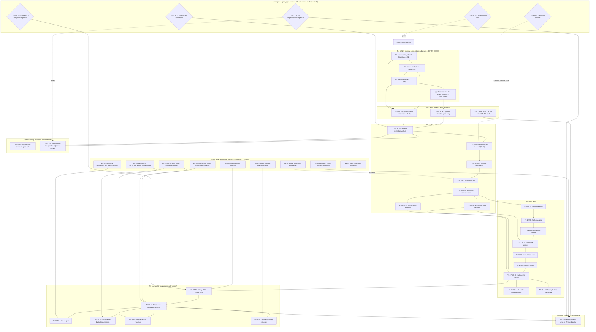

# DAG — T2 · #2181 autoresearch loop (evaluator-first ratchet MVP)

## Thread summary

T2 builds the #2181 autoresearch loop as an **evaluator-first ratchet MVP** (ORTH-1 + Approach-D
fusion): a git-ratchet loop with restart-from-best-K + a diversity-quota Leap-Path, assembled as a
*walking skeleton* around a frozen sealed `EvaluateFn` seam and an immutable, SHA-pinned,
execution-verified evaluator that holds a **monopoly on every fitness scalar** — no LLM judgment
ever produces a number the loop ratchets on. The substrate is **pure-xtrax + bathos-MCP**: all
effectful actions (git commit/reset, evaluator invocation, run/campaign emission) route through a
thin pure-xtrax run-layer controller and the bathos MCP surface, with **zero praxia coupling**
(sidestepping the rig-run-can't-dispatch-plugin-flows blocker; strict-mode/praxia dispatch is a
gated Phase-2 option, not an MVP dependency). Fitness is a flat `dict[str, float]`; compile time is
**excluded** from runtime fitness but tracked as its own gated metric (ORTH-4 two-phase clock); the
information barrier is **shared-responsibility** with a deterministic loud xtrax-side lint floor
(ORTH-2). **bathos owns all campaign rigor** — the statistical battery (`bathos[stats]`), seed-gate,
sidecar-drift, signed-manifest attestation, and the campaign DAG (`campaign_edges`) — while xtrax
stays truth-emitting, not gate-owning. The five human gates persist as explicit DAG nodes bound to
machine-checkable probes + TTL attestation (freshness mechanism owned by thread T3). **Island search
is an evidence-gated Phase-2 delta**, not a frozen-interface commitment: the scalar single-candidate
seam is shaped now so island drop-in is a config flip later, and P4 is explicitly gated on the full
GEAR + AutoSOTA read (emitted as a cheap research item early in the DAG). #2181's only substrate
dependency is T1's minimal-composition child (S2 executed io_callback boundaries + S3 graph
serialization/CLI + S4 sealed `EvaluateFn` seam), with T1's typed-composition-IR deterministic
validation-gate verdict as a required entry-criterion edge.

## Phase overview

| Phase | Scope | Items | Blocking bathos work |
|---|---|---|---|
| **P0** | entry-edge verification + early research | 3 (T2-01…03) | none |
| **P1** | walking skeleton `{AC-E2,7,8,9,11,13,14}` | 7 (T2-04…10) | **none** (uses existing bathos MCP surface) |
| **CC** | cross-cutting invariants (CI-wide from P1) | 2 (T2-20,21) | none |
| **P2** | loop MVP (static→checkify gates, ratchet, diversity, compile clock) | 9 (T2-11…19) | stdout-redaction (P2 autonomous hardening only) |
| **P3** | campaign integration (confirmatory) | 6 (T2-22…27) | seed / stats / drift / attestation / probe / bridge |
| **HG** | human-gate DAG nodes (gate_type: human) | 5 (T2-28…32) | none |
| **P4-gated** | island/GEAR upgrade | 1 (T2-33) | `campaign_edges` multi-parent |
| **bathos lane** | cross-repo build items (workspace: bathos) | 9 (B2-01…09) | — |

**Load-bearing invariant (mandate + spec):** *no bathos build item may block the P1 walking
skeleton.* P1 provenance (AC-8) rides the **existing** bathos surface — `claim_register` /
`claim_attest_parity` / run sidecar / `manifest_sha256` lock — which the capability map lists as
EXISTS. The nine bathos BUILD items gate only P3 confirmatory campaigns (seed/stats/probe) and the
P4 island delta (`campaign_edges`); `stdout`-redaction hardens the P2 *autonomous* loop, not the P1
attended skeleton.

## DAG



**ASCII critical-path spine (fast read):**

```
xtrax0.3.0 → T1[D3→D2→D4→IR] ─entry→ P0(T2-01 IR-gate, T2-02 substrate) 
   → P1 walking skeleton (T2-04 seam-lock → T2-05 closure-HALT → T2-06 provenance
       → T2-07 info-barrier → T2-08 completeness → {T2-09 watchdog, T2-10 crash-atomic})
   → P2 loop MVP (T2-11..15 static→checkify → T2-16 prereg → T2-17 ratchet
       → {T2-18 diversity, T2-19 compile-clock})
   → P3 confirmatory (T2-27 probe → T2-22 stats ← bathos lane B2-01..08)
   → P4-gated island delta (T2-33 ← T2-03 GEAR read + B2-03 campaign_edges)

human gates (◇): T2-28 ⟂ loop-start · T2-29 ⟂ evaluator-change · T2-30 ⟂ promotion
                 T2-31 ⟂ scope-expansion · T2-32 ⟂ campaign-start/kill
cross-cutting (CI-wide from P1): T2-20 grep-gate · T2-21 dispatch-independence
```

---

## P0 — entry-edge verification + early research

> Consume T1's minimal-composition-substrate deliverables + the typed-IR validation-gate verdict.
> Dependencies reference **T1 entry-edge items** and **#2174**. Cheap; unblocks P1 and P4 planning.

### T2-01 — typed-IR validation-gate entry edge (AC-E1)
- workspace: xtrax · category: entry-gate · priority: P1 · difficulty: quick
- depends_on: [T1-10, T1-08, T1-11, #2174]  # typed-IR validate verb = T1-10; graph serialize/CLI = T1-08 + T1-11 (D4↔S3)
- acs_covered: [AC-E1]
- gate: candidate composition graph → T1 deterministic validation-gate (`extract_schema`-consistency
  + `validate_plan_topology` + jaxlint) writes `audit_verdict ∈ {PASS,FAIL,NEEDS_WORK}` to node
  metadata.
  - success: `PASS` admits the graph into the loop.
  - fast/loud: `FAIL`/`NEEDS_WORK` → CLI exit 1 + structured JSON envelope naming the failing check;
    loop refuses the candidate (never trusts an unvalidated graph).
- backlog-add: "AC-E1 typed-IR validation-gate entry edge: gate loop admission on T1's
  audit_verdict=PASS; FAIL/NEEDS_WORK → exit 1 + JSON envelope, candidate refused. Consumes #2174
  typed-composition-IR `graph validate` verb."

### T2-02 — minimal-substrate consumption (F-C dependency binding)
- workspace: xtrax · category: entry-verify · priority: P1 · difficulty: quick
- depends_on: [T1-04, T1-05, T1-07, T1-08, T1-11, #2174]  # S2 executed boundaries = T1-04 + T1-05 (nested-ordering cert); S3 graph serialize/CLI = T1-08 + T1-11; S4 sealed seam = T1-07 (D↔S: D3↔S2, D4↔S3, D2↔S4)
- acs_covered: [] (F-C binding; feeds AC-E2)
- gate: verify the S2/S3/S4 child deliverables landed as **real load-bearing code** and are
  importable from `src/xtrax` (PM-3 anti-stub). The executed-boundaries deliverable is certified
  **only when T1-05 (nested-ordering stress harness) is green** — T1-04's flat-scan AC4 is
  necessary-not-sufficient (PM1 provenance). Graph-serialization/CLI resolves to **both T1-08
  (serialize + version gate) and T1-11 (graph→plan parity through the CLI)**.
  - success: executed io_callback boundaries (T1-04 **and** T1-05 certified) + graph serialize/CLI
    (T1-08 **and** T1-11) + sealed seam (T1-07) all resolve to `src/xtrax`; #2181's `depends_on`
    re-points from `pure-jax-composition-layer` to the child id.
  - fast/loud: any deliverable resolves to a test double / stub, **OR T1-05 is not green** (executed
    boundaries uncertified) → CI exit 1 (blocks P1 start).
- backlog-add: "F-C substrate consumption: confirm T1 S2/S3/S4 landed as real src/xtrax code (not
  stubs) before P1 — executed boundaries certified only with T1-05 green (T1-04 alone is
  necessary-not-sufficient, PM1); graph serialize/CLI = T1-08 + T1-11; sealed seam = T1-07. Re-point
  #2181 depends_on to the minimal-composition child. Blocks walking skeleton."

### T2-03 — GEAR + AutoSOTA full read (Phase-2 unblocker)
- workspace: xtrax · category: research · priority: P2 · difficulty: quick
- depends_on: [] (independent; schedule early)
- acs_covered: [] (planning artifact for P4)
- gate: full read of **GEAR (arXiv 2605.13874)** — currently title-verified only — plus **AutoSOTA**,
  before any island-search DAG node is finalized.
  - success: research note recording whether GEAR's ratchet/island hybrid changes the Phase-2 plan
    or the `evaluate()` seam contract; feeds the P4 gate decision.
  - fast/loud: N/A (research errand) — but **P4 (T2-33) is hard-blocked until this completes**.
- backlog-add: "Read GEAR (2605.13874) + AutoSOTA in full; record Phase-2 island-vs-ratchet
  implications + any evaluate()-seam impact. Cheap; unblocks P4 planning. Title-verified evidence
  cannot justify committing the seam to a guessed population contract."

---

## P1 — walking skeleton `{AC-E2, AC-7, AC-8, AC-9, AC-11, AC-13, AC-14}`

> Sprint-1 subset. Proves the immutable-evaluator monopoly end-to-end on one function **before** any
> rigor machinery. Uses only the existing bathos MCP surface — no bathos BUILD item blocks it.

### T2-04 — no-stub sealed-seam lock (AC-E2, PM-3)
- workspace: xtrax · category: entry-gate · priority: P1 · difficulty: moderate
- depends_on: [T2-01, T2-02, T2-28]  # T2-28 constitution gate blocks loop start
- acs_covered: [AC-E2]
- gate: sealed `EvaluateFn` seam import resolves to `src/xtrax` (the real S4 seam) and is
  registration-locked.
  - success: import path under `src/xtrax`; a second registration raises.
  - fast/loud: grep-gate finds a mock / test-double import for the seam → CI exit 1.
- backlog-add: "AC-E2 no-stub sealed-seam lock: seam import resolves to src/xtrax + registration
  re-lock raises; grep-gate for mock/test-double seam imports → exit 1 (PM-3 kills scaffolding-that-
  never-became-load-bearing)."

### T2-05 — eval-closure-invariant / full-closure SHA lock (AC-7, F2, PM-1)
- workspace: xtrax · category: in-loop-gate · priority: P1 · difficulty: involved
- depends_on: [T2-04, T1-07]  # D2 sealed EvaluateFn seam = T1-07 (D2↔S4)
- acs_covered: [AC-7]
- gate: per iteration, SHA-256 of the evaluator's **COMPLETE CLOSURE** (code + splits + metric-defs +
  pinned deps + config) == the locked manifest **AND** the candidate touched no protected path
  **AND** every path the evaluator reads is enumerated in the closure manifest.
  - success: closure hash matches; zero unlisted reads; no protected-path mutation.
  - fast/loud: **HALT the loop + human escalation** — non-recoverable, not mere candidate rejection
    (PM-1: hashing the file not the closure is the one non-recoverable event); any unlisted-path read
    fails loud.
- backlog-add: "AC-7 eval-closure-invariant: per-iteration hash the evaluator's FULL closure
  (code+splits+metric-defs+pinned-deps+config) vs locked manifest + enumerate every read path; any
  drift/unlisted read → HALT + human escalation (PM-1 non-recoverable)."

### T2-06 — metrics-provenance (AC-8, F1)
- workspace: xtrax · category: in-loop-gate · priority: P1 · difficulty: moderate
- depends_on: [T2-05] · uses existing bathos: `claim_register` / `claim_attest_parity` / run sidecar
- acs_covered: [AC-8]
- gate: every fitness scalar traces 100% to the immutable-evaluator stdout envelope + bathos
  sidecar/manifest attestation.
  - success: full provenance chain per scalar; agent-reported numbers never accepted.
  - fast/loud: metrics discarded, iteration voided, loud provenance error (MLR-Bench: 80%
    fabrication — never trust self-reported numbers).
- backlog-add: "AC-8 metrics-provenance: fitness scalars 100% traceable to evaluator stdout envelope
  + bathos sidecar/manifest attestation; unprovenanced/self-reported → discard + void iteration.
  Rides existing bathos claim_register/attest_parity — no BUILD item needed."

### T2-07 — info-barrier-lint (AC-9, F3, PM-5, ORTH-2)
- workspace: xtrax · category: in-loop-gate · priority: P1 · difficulty: involved
- depends_on: [T2-06] · hardened by bathos B2-05 (defense-in-depth, not a P1 blocker)
- acs_covered: [AC-9]
- gate: agent-facing outputs are (a) schema-validated JSON with **no raw-log read path** reachable
  from agent context, **and** (b) field-whitelisted, carry no per-split granularity, and cross-
  iteration fitness-delta exposure is rate/precision-limited.
  - success: deterministic lint passes; only whitelisted envelope fields reachable.
  - fast/loud: iteration blocked; LOUD-FAIL schema/content error; never skip-on-drift (PM-5: the
    barrier must bound the *sanctioned* envelope content, not only the raw channel).
- backlog-add: "AC-9 info-barrier-lint: agent outputs = schema-validated JSON, zero raw-log read
  path, field-whitelisted, no per-split granularity, rate/precision-limited fitness deltas; any raw
  path or over-broad field → block + LOUD-FAIL. xtrax-side floor; bathos get_run redaction (B2-05)
  hardens autonomous mode."

### T2-08 — evaluator-completeness (AC-11, PM-2)
- workspace: xtrax · category: in-loop-gate · priority: P1 · difficulty: moderate
- depends_on: [T2-05]
- acs_covered: [AC-11]
- gate: at registration the evaluator asserts **every invariant in a reviewed invariant-manifest**
  (correctness/stability floors beyond the optimization target) **and** passes a synthetic-ground-
  truth sanity check (one-hot fitness case, per the BATHOS measurement-verification rule).
  - success: all invariants asserted + synthetic sanity passes → loop may start.
  - fast/loud: registration refused, loud; loop cannot start (PM-2: what you don't measure, the agent
    games — Cerebras faster-but-more-memory generalized).
- backlog-add: "AC-11 evaluator-completeness: evaluator asserts a reviewed invariant-manifest
  (correctness/stability floors) + passes one-hot synthetic-ground-truth sanity (BATHOS rule) at
  registration, else refuse loop start. Blocks reward-hacking of untracked properties (PM-2)."

### T2-09 — external-stop watchdog (AC-13, F9, PM-7)
- workspace: xtrax · category: in-loop-gate · priority: P1 · difficulty: involved
- depends_on: [T2-08]
- acs_covered: [AC-13]
- gate: a **separate watchdog process** — kill authority unrevokable by the loop, termination
  criteria never visible/editable to the agent — hard-kills the loop on budget exhaustion or
  convergence.
  - success: watchdog terminates within wall-clock/compute budget; lineage preserved via git.
  - fast/loud: watchdog hard-kill; a wedged candidate (hang/OOM) cannot wedge the watchdog (PM-7:
    external-stop must not share a process with the loop).
- backlog-add: "AC-13 external-stop watchdog: SEPARATE process, kill authority unrevokable by the
  loop, criteria invisible/uneditable to the agent; hard-kill on budget/convergence, lineage
  preserved. Deferred praxia contract-DAG budget enforcement is NOT load-bearing for this (PM-7)."

### T2-10 — ratchet-crash-atomicity (AC-14, PM-7)
- workspace: xtrax · category: in-loop-gate · priority: P1 · difficulty: moderate
- depends_on: [T2-08]
- acs_covered: [AC-14]
- gate: git-as-memory writes are crash-atomic (tmp-commit + fsync + atomic ref update); a crash
  mid-ratchet (between commit and reset) never loses best-so-far lineage.
  - success: recovery restores best-so-far after an injected mid-ratchet crash.
  - fast/loud: loud recovery error; never silent loss of lineage.
- backlog-add: "AC-14 ratchet-crash-atomicity: tmp-commit + fsync + atomic ref update so a mid-
  ratchet crash never loses best-so-far; recovery test asserts lineage intact, loud on any loss
  (PM-7 git-as-memory had no transaction boundary)."

---

## CC — cross-cutting invariants (CI-wide, enforced from P1)

### T2-20 — compiler-boundary grep-gate (AC-26, F-A)
- workspace: xtrax · category: invariant · priority: P1 · difficulty: quick
- depends_on: [T2-04, T1-14]  # reuses the #2174 grep-gate recipe (T1-14) — do not re-implement
- acs_covered: [AC-26]
- gate: `src/xtrax` contains zero UI/chain-map/plugin-state identifiers.
  - success: zero grep hits.
  - fast/loud: CI exit 1.
- backlog-add: "AC-26 compiler-boundary grep-gate: zero UI/chain-map/plugin-state identifiers in
  src/xtrax → else CI exit 1. Reuses the #2174 grep-gate recipe; CI-wide from P1."

### T2-21 — dispatch-independence (AC-28, forks 15/16)
- workspace: xtrax · category: invariant · priority: P1 · difficulty: moderate
- depends_on: [T2-04]
- acs_covered: [AC-28]
- gate: the loop's effectful actions (git commit/reset, evaluator invocation, bathos run/campaign
  emission) route **pure-xtrax run-layer + bathos-MCP** with **zero praxia rig-run dependency**.
  - success: loop runs end-to-end with **praxia absent**.
  - fast/loud: any praxia-plugin-dispatch dependency detected → INVEST-Independence violation flagged
    in CI, exit 1. (Controller authored so its gate topology is *later* liftable into a praxia
    WorkflowTemplate once G1/G2 land — no MVP dependency on it.)
- backlog-add: "AC-28 dispatch-independence: effectful actions route pure-xtrax + bathos-MCP, praxia
  absent; any praxia rig-run dep → CI exit 1. Controller gate-topology liftable to a praxia
  WorkflowTemplate post-G1/G2, but never depends on it."

---

## P2 — loop MVP

> Static → checkify pre-gates (cheap-before-GPU), prereg-match, the multi-metric ratchet, semantic
> diversity quota, and the two-phase compile clock. Assembles the full ratchet loop.

### T2-11 — candidate-static (AC-1, F0)
- workspace: xtrax · category: in-loop-gate · priority: P2 · difficulty: quick
- depends_on: [T2-08]
- acs_covered: [AC-1]
- gate: mutated candidate → clean import + zero jaxlint JL-series errors.
  - success: static gate green before any compute.
  - fast/loud: reject pre-compute; structured JSON error envelope; exit 1; zero GPU time spent.
- backlog-add: "AC-1 candidate-static: clean import + zero jaxlint JL errors before compute; reject
  pre-compute with JSON envelope, exit 1, zero GPU time."

### T2-12 — schema-gate (AC-2)
- workspace: xtrax · category: in-loop-gate · priority: P2 · difficulty: quick
- depends_on: [T2-11]
- acs_covered: [AC-2]
- gate: candidate slotted into a StageBundle → `extract_schema` (`jax.eval_shape`, zero FLOPs)
  derived schema == the slot's declared BundleSchema.
  - success: schema equality, zero-cost.
  - fast/loud: reject before any execution; loud schema-mismatch error.
- backlog-add: "AC-2 schema-gate: eval_shape-derived schema == slot BundleSchema (zero FLOPs); reject
  pre-execution on mismatch, loud."

### T2-13 — structure-tripwire (AC-3)
- workspace: xtrax · category: in-loop-gate · priority: P2 · difficulty: quick
- depends_on: [T2-12]
- acs_covered: [AC-3]
- gate: schema-passing candidate → `verify_structure` on one tiny batch, abstract == concrete
  pytree/shape/dtype. (Note: `verify_structure` executes the candidate exactly once — first-concrete-
  run tripwire, not zero-cost.)
  - success: abstract==concrete on one cheap execution.
  - fast/loud: `StructureMismatchError`; candidate rejected after exactly one cheap execution.
- backlog-add: "AC-3 structure-tripwire: verify_structure on one tiny batch, abstract==concrete
  pytree/shape/dtype; StructureMismatchError → reject after exactly one cheap exec."

### T2-14 — candidate-smoke (AC-4, F4)
- workspace: xtrax · category: in-loop-gate · priority: P2 · difficulty: moderate
- depends_on: [T2-13, T2-09]  # watchdog (T2-09) must exist before the first autonomous candidate execution
- acs_covered: [AC-4]
- gate: structurally-valid candidate → L1 dry-run + L2 CPU smoke under the pinned uv lockfile, both
  exit 0 in <60 s.
  - success: both gates exit 0 under 60 s.
  - fast/loud: reject pre-budget; sanitized failure summary; no GPU/cluster submission.
- backlog-add: "AC-4 candidate-smoke: L1 dry-run + L2 CPU smoke <60 s under pinned uv lockfile; reject
  pre-budget with sanitized summary, no GPU/cluster submission."

### T2-15 — checkified-execution (AC-5)
- workspace: xtrax · category: in-loop-gate · priority: P2 · difficulty: moderate
- depends_on: [T2-14]
- acs_covered: [AC-5]
- gate: smoke-passing candidate executed under `SafetyManager(enabled=True)` checkify float_checks →
  no NaN/Inf/overflow. (Promoted best-lineage runs execute `enabled=False` = strict identity.)
  - success: no NaN/Inf/overflow under checkify.
  - fast/loud: host-side raise; candidate marked failed; git reset.
- backlog-add: "AC-5 checkified-execution: SafetyManager(enabled=True) checkify float_checks, no
  NaN/Inf/overflow → else host-side raise + git reset. Promoted runs use enabled=False (strict
  identity)."

### T2-16 — prereg-match (AC-6, F8)
- workspace: xtrax · category: in-loop-gate · priority: P2 · difficulty: moderate
- depends_on: [T2-15] · uses existing bathos `gate_check`
- acs_covered: [AC-6]
- gate: candidate run config == the pre-registered hypothesis+metric sidecar (bathos `gate_check`).
  - success: run config matches sidecar.
  - fast/loud: bathos denial with structured `GateErrorPayload`; candidate rejected.
- backlog-add: "AC-6 prereg-match: run config == bathos pre-registered hypothesis+metric sidecar via
  gate_check; mismatch → GateErrorPayload denial, candidate rejected. Existing bathos gate."

### T2-17 — multi-metric-regression ratchet (AC-10, F7, PM-2)
- workspace: xtrax · category: in-loop-gate · priority: P1 · difficulty: involved
- depends_on: [T2-16, T2-10, T2-09]  # watchdog (T2-09) in place before the ratchet commits autonomously
- acs_covered: [AC-10]
- gate: candidate fitness dict vs current best → label 'improvement' **only if** WR ≥ 0.6 **AND**
  BP ≥ 0.2 **AND** Cohen's d ≥ 0.2 across the fitness dict.
  - success: ratchet commits only on a genuine multi-metric win.
  - fast/loud: no ratchet commit; git reset to previous best (blocks silent semantic failure, e.g.
    faster-but-more-memory).
- backlog-add: "AC-10 multi-metric ratchet: 'improvement' iff WR≥0.6 AND BP≥0.2 AND Cohen's d≥0.2
  over the fitness dict; else git reset to best. Blocks faster-but-more-memory silent regressions."

### T2-18 — diversity-quota-semantic (AC-12, F5, PM-6)
- workspace: xtrax · category: in-loop-gate · priority: P2 · difficulty: involved
- depends_on: [T2-17] · reuses #2174 typed-IR for structural diff
- acs_covered: [AC-12]
- gate: over N consecutive iterations (default N=5), ≥1 **semantically-structural** mutation
  (AST/composition-IR structural diff, **not** text diff).
  - success: ≥1 structural mutation per N; Leap-Path fires when the quota is unmet.
  - fast/loud: forced Leap-Path structural mutation scheduled + audit finding emitted; cosmetic edits
    (renames, commutative reorders) do NOT count (PM-6: syntactic counting is theater).
- backlog-add: "AC-12 diversity-quota-semantic: ≥1 AST/IR-structural mutation per N=5 iters (not
  text); else schedule forced Leap-Path + emit audit finding. Cosmetic renames/reorders don't count
  (PM-6). Reuses #2174 typed-IR structural diff."

### T2-19 — compile-time two-phase clock (AC-27, fork 3, ORTH-4)
- workspace: xtrax · category: in-loop-gate · priority: P2 · difficulty: moderate
- depends_on: [T2-17]
- acs_covered: [AC-27]
- gate: runtime fitness **excludes** compile time (persistent XLA cache warms first compile) **and**
  compile time is recorded as its own tracked metric.
  - success: fitness comparison compile-time-invariant; compile metric tracked separately.
  - fast/loud: compile-time-regression gate flags a blowup loud when compile time > K× rolling median
    (default K=3), without polluting the runtime fitness comparison.
- backlog-add: "AC-27 compile-time two-phase clock: runtime fitness excludes compile time (persistent
  XLA cache) + track compile time as its own metric; compile > 3× rolling median → loud regression
  flag, no fitness pollution."

---

## P3 — campaign integration (confirmatory campaigns)

> xtrax-side integration/consumption glue for the bathos rigor lane. Each item is the xtrax half of a
> cross-repo edge; the actual gate logic lives in the bathos build item it depends on. **These block
> only confirmatory campaigns**, never the walking skeleton.

### T2-22 — conclude-time statistical-battery wiring (AC-15)
- workspace: xtrax · category: campaign-integration · priority: P2 · difficulty: moderate
- depends_on: [T2-27, B2-01, B2-08]
- acs_covered: [AC-15]
- gate: at campaign conclude, the loop consumes the `bathos[stats]` battery verdict (Wilcoxon /
  Friedman+Nemenyi, α=0.05 Holm; Cohen's d ≥ 0.2; WR ≥ 0.6 or P(A>B) ≥ 0.75; BP ≥ 0.2; ICC > 0.990).
  - success: verdict consumed; confirmatory verdict honored.
  - fast/loud: verdict downgrade (`confounded`/`underpowered`) → hard block for confirmation/
    sequential, advisory for exploration; `bathos[stats]` uninstalled → graceful advisory-downgrade,
    loud in the campaign report.
- backlog-add: "AC-15 conclude stats-battery wiring: loop consumes bathos[stats] verdict at conclude;
  downgrade → hard block (confirm/sequential) / advisory (exploration); stats extra absent → loud
  advisory-downgrade. Depends bathos B2-01 + bridge B2-08."

### T2-23 — seed-gate integration (AC-16)
- workspace: xtrax · category: campaign-integration · priority: P2 · difficulty: quick
- depends_on: [T2-22, B2-02]
- acs_covered: [AC-16]
- gate: loop emits `Run.seed` + campaign mode; conclude enforces ≥3 seeds per `script_sha256` AND
  N ≥ 29 trials per `script_sha256` per hypothesis clause (power floor for P(A>B)>0.75 at β=0.05).
  - success: confirmatory conclude only with ≥3 seeds and N≥29 per clause.
  - fast/loud: cannot conclude 'held' → hard block; exploration campaigns → advisory anomaly only.
- backlog-add: "AC-16 seed-gate: loop emits Run.seed; conclude requires ≥3 seeds + N≥29 per
  script_sha256 per hypothesis clause for confirmatory → else can't conclude 'held' (hard block);
  exploration → advisory. Depends bathos B2-02."

### T2-24 — baseline-budget-equivalence (AC-17)
- workspace: xtrax · category: campaign-integration · priority: P2 · difficulty: quick
- depends_on: [T2-22, B2-01]
- acs_covered: [AC-17]
- gate: loop emits candidate + baseline HPO-trial/compute counts; conclude checks the baseline
  received ≥ equal HPO trials/compute as the candidate.
  - success: baseline budget ≥ candidate budget.
  - fast/loud: comparison verdict downgraded; loud in the campaign report.
- backlog-add: "AC-17 baseline-budget-equivalence: emit candidate+baseline HPO trials/compute;
  conclude downgrades the comparison if baseline underfunded, loud in report. Check lives in bathos
  B2-01 conclude gate."

### T2-25 — sidecar-drift reaction (AC-18)
- workspace: xtrax · category: campaign-integration · priority: P2 · difficulty: quick
- depends_on: [T2-22, B2-04]
- acs_covered: [AC-18]
- gate: across all runs of a script, the sidecar SHA is identical to the first-run manifest; loop
  reacts to `SIDECAR_HASH_MISMATCH`.
  - success: sidecar SHA stable across runs.
  - fast/loud: deny (autonomous mode) / warn (collaborative mode) — cheapest highest-leverage
    immutable-evaluator safeguard.
- backlog-add: "AC-18 sidecar-drift reaction: loop honors bathos SIDECAR_HASH_MISMATCH — deny
  (autonomous) / warn (collaborative). Depends bathos B2-04 (promote reserved code)."

### T2-26 — attestation-as-evidence (AC-19)
- workspace: xtrax · category: campaign-integration · priority: P2 · difficulty: quick
- depends_on: [T2-22, B2-07]
- acs_covered: [AC-19]
- gate: a run admitted as evidence must verify its signed `manifest_sha256` + stdout hash.
  - success: attested runs only in the evidence set.
  - fast/loud: unverifiable run excluded from evidence, loud (full K-Veritas RSA-PSS deferred to a
    late milestone).
- backlog-add: "AC-19 attestation-as-evidence: admit only runs whose signed manifest_sha256 + stdout
  hash verify; unverifiable → excluded, loud. Interim signed-manifest; K-Veritas deferred. Depends
  bathos B2-07."

### T2-27 — capability-probe gate (AC-20, PM-4)
- workspace: xtrax · category: campaign-integration · priority: P2 · difficulty: moderate
- depends_on: [T2-17, B2-06, T2-32]  # T2-32 campaign-approval gate blocks confirmatory campaign start
- acs_covered: [AC-20]
- gate: on confirmatory-campaign start, the loop controller machine-probes bathos that `Run.seed` +
  stats battery are **live** (not a hand-maintained attestation).
  - success: probe green → confirmatory campaign may start.
  - fast/loud: refuse to start the confirmatory campaign, loud (advisory/exploration campaigns may
    proceed) — PM-4: refuse until bathos capability is machine-verified, never assumed.
- backlog-add: "AC-20 capability-probe gate: controller machine-probes bathos for live Run.seed +
  stats battery before confirmatory start; not-live → refuse (loud), exploration may proceed.
  Machine-checkable, not attested (PM-4). Depends bathos B2-06."

---

## HG — human-gate DAG nodes (gate_type: human)

> The five F-E gates as explicit DAG nodes. Each binds to a **machine-checkable probe + timestamped
> TTL attestation** that goes stale **loudly** — the freshness primitive is the **T3-05**
> TTL-attestation + invalidate-only-probe library (`260702_03-dag-plugin-workflows.md`); cross-
> referenced here, **not duplicated**. Wording refined, never deleted (F-E).
>
> **Edge directionality (S-5 fix).** Each human-gate node (T2-28…32) `depends_on` **only** the
> freshness primitive `[T3-05]` — it does **not** depend on the loop items it governs (removing the
> earlier inversions T2-29→T2-05, T2-31→T2-21, T2-32→T2-09). The **gated** nodes depend on their
> gate: T2-04 (loop start) `depends_on` T2-28; T2-27 (confirmatory start) `depends_on` T2-32.
> **T2-29 (AC-22, evaluator-change) is a STANDING RUNTIME GATE** — it fires on evaluator-change
> events, not as a DAG-ordering edge.

### T2-28 — constitution authorship (AC-21, gate a)
- workspace: xtrax · category: human-gate · gate_type: human · priority: P1 · difficulty: quick
- depends_on: [T3-05]  # freshness primitive only
- acs_covered: [AC-21]
- gate: a constitution create/amend records explicit human sign-off bound to a machine-checkable
  probe (file hash present + timestamped TTL attestation).
  - success: signed-off + probe green → loop may start/continue.
  - fast/loud: loop cannot start/continue; node flips to **blocked loudly at TTL expiry**, never
    silently green.
- backlog-add: "AC-21 constitution-authorship human gate: human sign-off bound to file-hash probe +
  TTL attestation before loop start; blocked-loud at TTL expiry. Freshness mechanism ← T3-05, not
  duplicated."

### T2-29 — evaluator change (AC-22, gate b) — STANDING RUNTIME GATE
- workspace: xtrax · category: human-gate · gate_type: human · priority: P1 · difficulty: quick
- depends_on: [T3-05]  # freshness primitive only — NOT a DAG-ordering edge on T2-05 (S-5 fix)
- acs_covered: [AC-22]
- gate: **STANDING RUNTIME GATE** (fires on evaluator-change *events*, not a topological DAG edge):
  any change to evaluator code, splits, or metric definitions is gated by a human-approval node —
  the agent never approves its own judge. When it fires it forces a closure-hash re-lock (T2-05)
  before the changed evaluator is trusted.
  - success: human sign-off + closure-hash re-lock (T2-05) before the changed evaluator is trusted.
  - fast/loud: change rejected; loop halts until human sign-off + closure hash re-lock.
- backlog-add: "AC-22 evaluator-change STANDING RUNTIME gate: fires on any evaluator/splits/metric
  change (event-triggered, not a DAG-ordering edge) → requires human sign-off + closure-hash re-lock
  (T2-05); agent never approves its own judge. Freshness ← T3-05."

### T2-30 — promotion-to-main (AC-23, gate c)
- workspace: xtrax · category: human-gate · gate_type: human · priority: P1 · difficulty: quick
- depends_on: [T3-05]  # freshness primitive only
- acs_covered: [AC-23]
- gate: evolved code proposed for promotion out of the sandbox lineage into xtrax main is gated by a
  human-review node.
  - success: human engineering review passes → promotion allowed.
  - fast/loud: promotion refused; code stays in sandbox lineage (honors `no_autonomous_push_or_merge_to_main`).
- backlog-add: "AC-23 promotion-to-main human gate: no evolved candidate merges to xtrax main without
  human engineering review; else stays in sandbox lineage. Freshness ← T3-05."

### T2-31 — scope / allowlist expansion (AC-24, gate d)
- workspace: xtrax · category: human-gate · gate_type: human · priority: P1 · difficulty: quick
- depends_on: [T3-05]  # freshness primitive only — NOT a DAG-ordering edge on T2-21 (S-5 fix)
- acs_covered: [AC-24]
- gate: any network/tool-allowlist or sandbox-capability expansion (incl. adding evolve-block surface
  or new effectful tools) is gated by a human-approval node.
  - success: human approval → capability expanded.
  - fast/loud: request denied; capabilities unchanged.
- backlog-add: "AC-24 scope/allowlist-expansion human gate: adding evolve-block surface or any
  network/tool/sandbox capability requires human approval; else denied, capabilities unchanged.
  Freshness ← T3-05."

### T2-32 — kill-switch / campaign approval (AC-25, gate e)
- workspace: xtrax · category: human-gate · gate_type: human · priority: P1 · difficulty: quick
- depends_on: [T3-05]  # freshness primitive only — NOT a DAG-ordering edge on T2-09 (S-5 fix)
- acs_covered: [AC-25]
- gate: a human authority approves every campaign start and can kill at any time via the
  out-of-agent-context watchdog (T2-09 / AC-13).
  - success: approved campaign starts; kill authority always available.
  - fast/loud: campaign cannot start unapproved; kill authority always available and **unrevokable by
    the loop**.
- backlog-add: "AC-25 kill-switch/campaign-approval human gate: human approves each campaign start +
  holds an always-available, loop-unrevokable kill via the watchdog (T2-09). Freshness ← T3-05."

---

## P4-gated — island / GEAR upgrade

> Explicitly gated on the **full GEAR + AutoSOTA read (T2-03)** plus the **T2-31 (AC-24)
> scope-expansion gate** — island-phase entry is a scope expansion, adjudicated by that human gate
> (there is no separate undefined `HUMAN:` node). Not a frozen-interface commitment: the scalar
> single-candidate seam is shaped for a config-flip drop-in, and the "island upgrade delta" is
> documented rather than promised as zero-cost.

### T2-33 — island / population-search drop-in (Phase-2 delta)
- workspace: xtrax · category: upgrade-delta · priority: P3 · difficulty: involved
- depends_on: [T2-03, B2-03, T2-22, T2-31]  # island-phase entry is a scope expansion, adjudicated by the T2-31 (AC-24) scope-expansion gate
- acs_covered: [] (documented delta; no MVP AC)
- gate: island search drops in **only after** GEAR/AutoSOTA is read in full, `campaign_edges`
  multi-parent lineage is live, and the **T2-31 (AC-24) scope-expansion gate** approves island-phase
  entry (island search = a scope expansion). Delta = batch/generation eval,
  population state, migration hooks, per-candidate resource accounting.
  - success: island runs as a config flip over the unchanged scalar `evaluate()` seam; multi-parent
    campaign DAG assembled by bathos.
  - fast/loud: refuse to finalize any island DAG node until T2-03 completes (title-verified evidence
    cannot justify committing the seam to a guessed population contract). Island pays off only at
    large parallel budgets absent at single-GPU scale.
- backlog-add: "island/population drop-in (Phase-2): batch/generation eval + population state +
  migration hooks + per-candidate resource accounting as a config flip over the frozen scalar seam.
  Gated on T2-03 GEAR read + bathos campaign_edges (B2-03) + T2-31 (AC-24) scope-expansion gate
  (island-phase entry is a scope expansion). Deferred."

> **Named deferrals (not omissions):** tree-structured AutoSOTA rubric fitness (nested-dict extension
> keeps the scalar-leaf contract; deferred behind the flat `dict[str,float]`); full K-Veritas RSA-PSS
> nonrepudiation (signed-manifest interim chosen, AC-19); Stitch library-learning compression (no
> validated-graph corpus yet); component-level `bathos_sidecar_ref` code enforcement (slot kept, see
> B2-08).

---

## Cross-repo — bathos build items (workspace: bathos)

> The nine bathos BUILD items from the capability map (§1.4) + ACs 15-20. Filed in the **bathos**
> workspace as edges out of this roadmap. **Blocking rule:** *none blocks the P1 walking skeleton*;
> seed/stats/probe/attestation/drift/bridge block only **P3 confirmatory campaigns**;
> `campaign_edges` blocks the **P4** island delta; `stdout`-redaction hardens the **P2 autonomous**
> loop (not the P1 attended skeleton).

### B2-01 — bathos[stats] statistical battery (+ baseline-budget check)
- workspace: bathos · category: cross-repo-gate · priority: P2 · difficulty: involved
- depends_on: [] · consumed_by: [T2-22, T2-24]
- acs_covered: [AC-15, AC-17]
- blocks: **P3** (confirmatory conclude)
- gate: new `bathos/stats_gates.py` invoked from `conclude_campaign` — Wilcoxon signed-ranks pairwise
  / Friedman+Nemenyi multi-model at α=0.05 Holm step-down; Cohen's d ≥ 0.2; WR ≥ 0.6 or P(A>B) ≥
  0.75; BP ≥ 0.2; ICC > 0.990; plus baseline-HPO-budget equivalence. scipy behind the `[stats]`
  extra.
  - success: verdict emitted natively from conclude; mode-dependent downgrade path native.
  - fast/loud: verdict downgrade (`confounded`/`underpowered`) — hard block confirm/sequential,
    advisory exploration; extra uninstalled → graceful advisory-downgrade, loud in report.
- backlog-add: "[bathos] bathos[stats] battery in stats_gates.py from conclude_campaign: Wilcoxon /
  Friedman+Nemenyi α=0.05 Holm, Cohen d≥0.2, WR≥0.6|P(A>B)≥0.75, BP≥0.2, ICC>0.990 + baseline-budget
  equivalence; scipy behind [stats] extra, graceful advisory-downgrade if absent. Blocks P3."

### B2-02 — Run.seed field (+ baseline_hpo_trials / compute)
- workspace: bathos · category: cross-repo-schema · priority: P2 · difficulty: moderate
- depends_on: [] · consumed_by: [T2-23]
- acs_covered: [AC-16]
- blocks: **P3** (seed-gate)
- gate: add `seed` to the Run schema (paired with `baseline_hpo_trials`/compute) so ≥3-seed ICC
  replication and N≥29-per-`script_sha256` power floors are enforceable at conclude.
  - success: seed persisted per run; conclude can count seeds/trials per `script_sha256` per clause.
  - fast/loud: confirmatory conclude with <3 seeds cannot report 'held' (hard block downstream).
- backlog-add: "[bathos] add Run.seed (+ baseline_hpo_trials/compute) to the Run schema so ≥3-seed
  ICC + N≥29-per-script_sha256 power floors are enforceable at conclude. Blocks P3 seed-gate."

### B2-03 — campaign_edges (multi-parent campaign DAG + PROV)
- workspace: bathos · category: cross-repo-schema · priority: P2 · difficulty: involved
- depends_on: [] · consumed_by: [T2-33]
- acs_covered: [] (campaign DAG ownership — fork 7)
- blocks: **P4** (island multi-parent lineage); P3 uses single-parent chains
- gate: multi-parent `campaign_edges` / `run_edges` table + multi-`wasDerivedFrom` PROV emission;
  bathos assembles the campaign DAG (xtrax emits run records with `campaign_id` + component sidecar
  refs, never owning the DAG — F-A / fork 7).
  - success: parallel-branch merges representable; single→multi-parent is natural bathos schema
    evolution over existing PROV lineage.
  - fast/loud: **campaign_edges round-trip + cycle-rejection contract test → exit 1** on any lossy
    round-trip or accepted cycle. Required before any island/population node.
- backlog-add: "[bathos] campaign_edges: multi-parent campaign/run DAG + multi-wasDerivedFrom PROV;
  bathos owns the DAG, xtrax emits run records with campaign_id + component sidecar refs. Blocks P4
  island delta."

### B2-04 — sidecar drift detection (promote SIDECAR_HASH_MISMATCH)
- workspace: bathos · category: cross-repo-gate · priority: P2 · difficulty: quick
- depends_on: [] · consumed_by: [T2-25]
- acs_covered: [AC-18]
- blocks: **P3**
- gate: promote the reserved-unimplemented `SIDECAR_HASH_MISMATCH` to live code — sidecar SHA
  identical to the first-run manifest across all runs of a script (mostly plumbing).
  - success: drift detected across a script's runs.
  - fast/loud: deny (autonomous) / warn (collaborative) — cheapest highest-leverage immutable-
    evaluator safeguard.
- backlog-add: "[bathos] promote reserved SIDECAR_HASH_MISMATCH to live: sidecar SHA == first-run
  manifest across all runs of a script; deny (autonomous) / warn (collaborative). Blocks P3."

### B2-05 — stdout redaction / info-barrier support
- workspace: bathos · category: cross-repo-gate · priority: P2 · difficulty: moderate
- depends_on: [] · hardens: [T2-07]
- acs_covered: [AC-9 (defense-in-depth half)]
- blocks: **P2 autonomous hardening** (NOT the P1 attended skeleton)
- gate: `get_run` redacts raw stdout for autonomous callers (the bathos half of the ORTH-2 shared-
  responsibility barrier; the xtrax lint floor T2-07 is the other half).
  - success: no raw-log read path reachable through the bathos MCP surface for autonomous agents.
  - fast/loud: raw-log read path present for an autonomous caller → loud lint failure (paired with
    T2-07).
- backlog-add: "[bathos] get_run stdout redaction for autonomous callers (ORTH-2 defense-in-depth
  with xtrax T2-07 lint floor). Hardens P2 autonomous loop; does NOT block the P1 attended skeleton."

### B2-06 — capability probe endpoint
- workspace: bathos · category: cross-repo-api · priority: P2 · difficulty: quick
- depends_on: [B2-01, B2-02] · consumed_by: [T2-27]
- acs_covered: [AC-20]
- blocks: **P3**
- gate: a machine-checkable endpoint reporting whether `Run.seed` + the stats battery are live (not a
  hand-maintained attestation).
  - success: loop controller can probe live-capability before confirmatory start.
  - fast/loud: probe returns not-live → loop refuses confirmatory start (T2-27), loud.
- backlog-add: "[bathos] capability probe endpoint: machine-checkable liveness of Run.seed + stats
  battery for the loop controller (PM-4, not attested). Blocks P3 confirmatory start."

### B2-07 — signed-manifest attestation fields
- workspace: bathos · category: cross-repo-schema · priority: P2 · difficulty: moderate
- depends_on: [] · consumed_by: [T2-26]
- acs_covered: [AC-19]
- blocks: **P3**
- gate: signed `manifest_sha256` + stdout-hash attestation fields for evidence admission (interim;
  full K-Veritas RSA-PSS + hardware telemetry deferred). MVP threat is self-deception/fabrication,
  which `claim_register`/`attest_parity` + signed manifest cover.
  - success: a run's signed manifest + stdout hash verify.
  - fast/loud: unverifiable run excluded from evidence, loud.
- backlog-add: "[bathos] signed-manifest attestation fields (manifest_sha256 + stdout hash) for
  evidence admission; K-Veritas deferred. Blocks P3 attestation-as-evidence."

### B2-08 — xtrax ↔ bathos bridge (component-level sidecar binding)
- workspace: bathos · category: cross-repo-bridge · priority: P2 · difficulty: involved
- depends_on: [] · consumed_by: [T2-06 (full component binding), T2-22]
- acs_covered: [AC-8 (component-level provenance)]
- blocks: **P3** (component-level binding); minimal P1 run emission uses the **existing** MCP surface
- ownership (dual-repo): **bathos owns the schema/API surface; the xtrax-side run-layer hook is a
  named sub-deliverable of this item, landing via an xtrax PR — neither half closes alone.**
- gate: thin run-layer hook (RunSpec/StageBundle) emitting bathos runs with `campaign_id` + component
  sidecar refs so sidecars bind to xtrax pipeline components (StageBundle/composition nodes), not
  just script files. xtrax stays truth-emitting, not gate-owning.
  - success: sidecars bind to composition components; runs carry `campaign_id`.
  - fast/loud: **bridge contract test (component sidecar binding round-trip + drift SHA propagation)
    → exit 1**; note P1 provenance (AC-8) does NOT wait on this — it rides existing
    `claim_register`/`attest_parity`/run-sidecar.
- backlog-add: "[bathos+xtrax] component-level sidecar binding: run-layer hook emits bathos runs with
  campaign_id + component sidecar refs (StageBundle/composition nodes). Blocks P3; P1 provenance uses
  existing MCP surface, not this."

### B2-09 — claim-calibration plumbing
- workspace: bathos · category: cross-repo-gate · priority: P3 · difficulty: quick
- depends_on: [B2-01] · consumed_by: [epic-gate reviewer]
- acs_covered: [] (epic-boundary claim calibration)
- blocks: **P3 / epic-gate** (nice-to-have)
- gate: embed the statistical verdicts (WR/BP/Cohen's d results) into `claim_coverage_report` so the
  epic-gate reviewer sees calibration ("SOTA"/"improved" wording only if WR ≥ 0.6 AND BP ≥ 0.2) in
  one artifact at judgment time.
  - success: coverage report carries the statistical verdicts.
  - fast/loud: claim wording downgraded when WR/BP thresholds unmet; finding routed to backlog_node.
- backlog-add: "[bathos] claim-calibration plumbing: embed WR/BP/Cohen-d verdicts into
  claim_coverage_report; downgrade 'SOTA'/'improved' wording unless WR≥0.6 AND BP≥0.2. Epic-gate
  nice-to-have."

---

## Fast/loud conventions (footer)

Inherited from the audit-framework template (deterministic spine, probabilistic leaves). Every gate
in this DAG states a **success metric AND a fast/loud failure behavior**; specifically:

- **(a) Schema discipline.** `schema_version` in every record; **LOUD-FAIL** on mismatch, never
  skip-on-drift. Loaders raise on missing/wrong-typed **required** fields (optional fields may carry
  explicit defaults).
- **(b) Resolvers raise.** Routing resolvers raise `ValueError` on unmatched rows — no silent default
  destination. Records self-validate (recompute hash) before append.
- **(c) Cheap-before-GPU.** Static → schema → structure → smoke gates (AC-1..4) reject **before**
  sustained GPU spend; a failing candidate costs at most one tiny concrete execution (the
  `verify_structure` tripwire).
- **(d) Fitness monopoly.** Fitness scalars come **only** from the SHA-closure-pinned evaluator
  (AC-7 hashes the complete closure, not the file); no LLM judgment produces any ratcheted number.
  Synthetic-ground-truth sanity (one-hot fitness) must pass before any campaign (BATHOS rule, AC-11).
- **(e) Non-recoverable vs recoverable.** Evaluator-closure drift (AC-7) and evaluator change (AC-22)
  **HALT + escalate** (non-recoverable); ordinary gate failures **git-reset** the candidate
  (recoverable).
- **(f) Crash-atomic state.** git-as-memory writes are tmp-commit + fsync + atomic ref update
  (AC-14); a mid-ratchet crash never loses best-so-far, loud on any loss.
- **(g) External kill.** The watchdog (AC-13) runs as a **separate process** with a kill authority the
  loop cannot revoke; termination criteria never visible/editable to the agent.
- **(h) Human gates fail loud, never silently green.** Every human-gate node binds to a machine-
  checkable probe + TTL attestation and **flips to blocked loudly at TTL expiry** (freshness owned by
  T3; no hand-maintained `expected_status` anywhere).
- **(i) One artifact, two consumers.** Every gate prints a JSON envelope and exits 1 on failure so CI
  and DAG walkers consume the same artifact; each gate recipe lints + contract-tests its own gate
  code first (gates are themselves gated).
- **(j) No silent caps.** Every deferred/skipped item above is a **named decision**, not an omission.

**Item counts** — P0: 3 · P1: 7 · CC: 2 · P2: 9 · P3: 6 · HG: 5 · P4-gated: 1 → **33 xtrax (T2-*)**;
**bathos lane: 9 (B2-*)** → **42 nodes total** (T1 entry-edge items referenced as dependencies, not
counted here).
