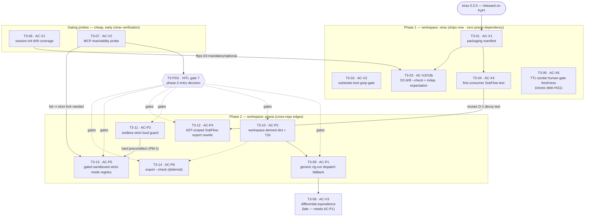

# T3 DAG — xtrax workflows as a praxia plugin (phased dual-track)

> **Enum normalization (praxia backlog).** priority ∈ {P1,P2,P3}, difficulty ∈ {quick,moderate,involved}.
> Mapping applied across all three DAG docs: priority critical/P0→P1, high→P2, medium→P2, low→P3;
> difficulty XS/S→quick, M→moderate, L/XL→involved.

## Thread summary

Phase 1 ships the **xtrax plugin packaging contract now, with zero praxia dependency**: a
`.praxia/manifest.toml` with one `[[plugin.workflows]]` entry per template, an xtrax-side D3
drift `--check` gate (mirrors `dw emit --check`, exit 1 on drift), a first-consumer SubFlow
integration test, a substrate-lock grep-gate keeping `port_validation` on its working
**Claude-PCW path (fork 16a)**, and a TTL-attestation + invalidate-only-probe freshness
mechanism for `distribution/release_readiness.toml` human gates. Phase 2 — teaching praxia's
`rig-run` to dispatch plugin flows and (optionally) serve strict-mode tools — is a **separate
cross-repo praxia-repo milestone**, sequenced behind an explicit **HITL phase-2-entry gate fed
by the AC-V2 MCP-reachability probe** (HITL gate 7). The strict-mode fork (AC-P5 / 16b) is built
**only if** AC-V2 fails (bathos MCP unreachable from a NO-CLAUDE node) **and** the toolless-strict
loud guard (AC-P3) has already landed — the two hard praxia edges must never drift apart (PM-1).
`port_validation` stays a **Claude PCW** throughout phase 1; dispatching it via the NO-CLAUDE
`rig-run` backend would silently swap its execution substrate (G3), so that is a deliberate
phase-2 decision, not packaging. Critically, **#2181 has no dependency on any praxia-side item**: its
autoresearch MVP is authored as a Claude PCW routing effectful actions through the bathos MCP
(15c-on-Claude-PCW), so it is pure-xtrax and praxia-decoupled — AC-28 dispatch-independence holds
and nothing on #2181's critical path waits on any AC-P* edge. **The one cross-thread edge is
xtrax-workspace T3-05 (the freshness primitive): the #2181 human-gate records
(constitution/campaign/kill) consume it, but T3-05 is not on the walking-skeleton critical path.**
Three cheap gating probes (AC-V1/
V2/V3) run early and decide dispositions rather than block value: AC-V1 flips D3 from
belt-and-suspenders to mandatory, AC-V2 gates the phase-2 strict fork, and AC-V3 (after AC-P1)
proves the two dispatch paths for a shared flow are equivalent.

## Item counts

| Group | Workspace | Items |
|---|---|---|
| Phase 1 (ship now) | xtrax | 5 — T3-01, T3-02, T3-03, T3-04, T3-05 |
| Gating probes (cheap, early) | xtrax (verification) | 2 — T3-06, T3-07 |
| Late verification (needs AC-P1) | xtrax (verification) | 1 — T3-08 |
| Phase-2 entry gate (HITL 7) | xtrax (human-gate) | 1 — T3-P2G |
| Phase 2 (cross-repo edges) | **praxia** | 6 — T3-09, T3-10, T3-11, T3-12, T3-13, T3-14 |
| **Total** | | **15** |

**praxia-workspace items:** T3-09 (AC-P1), T3-10 (AC-P2), T3-11 (AC-P3), T3-12 (AC-P4),
T3-13 (AC-P5), T3-14 (AC-P6) — the six AC-P\* cross-repo edges, filed in the praxia backlog.
All other 9 items are xtrax-workspace (5 phase-1 + 3 verification probes + 1 phase-2-entry HITL
gate T3-P2G).

---

## DAG



**Gating spine (ASCII, the load-bearing edges):**

```
xtrax 0.3.0 (released)
 └─ T3-01 AC-X1 manifest ──┬─ T3-04 AC-X4 first-consumer test ──▶ [phase2] T3-12 AC-P4 rewrite
                           └─ T3-03 AC-X3/X3b D3 drift ◀── T3-06 AC-V1 (flips mandatory/optional)
 T3-02 AC-X2 grep-gate (standing)      T3-05 AC-X6 freshness (closes debt #411)

── T3-P2G · HITL gate 7 (phase-2 entry) fed by ─▶ T3-07 AC-V2 MCP probe ──┐  (gates all of T3-09..14)
                                                                          ▼
[praxia] T3-10 AC-P2 ws-dirs ─▶ T3-09 AC-P1 generic dispatch ─▶ T3-08 AC-V3 differential (late)
[praxia] T3-11 AC-P3 toolless guard ─┐
                                     ├─▶ T3-13 AC-P5 strict registry  (GATED: AC-V2 fail ∧ AC-P3 ∧ HITL)
[praxia] T3-07 AC-V2 (fail) ─────────┘
[praxia] T3-14 AC-P6 export --check (deferred; supersedes D3's role)
```

---

## Backlog items

Each item block is pasteable into `backlog add`. `depends_on` uses local T3-\* keys (map to
backlog ids at file time). Every gate states a **success metric** and its **fast/loud** failure.

### Phase 1 — workspace: xtrax (ships now, zero praxia dependency)

#### T3-01 · AC-X1 — packaging manifest
- **workspace:** xtrax
- **category:** infra / packaging
- **priority:** P1
- **difficulty:** quick
- **depends_on:** [] (root — xtrax 0.3.0 released)
- **acs_covered:** AC-X1
- **gate — success:** `praxia plugin install <xtrax repo>` on a fresh `~/.praxia` exits 0 and the
  count of `~/.praxia/workflows/xtrax_*.yaml` equals the number of `[[plugin.workflows]]` entries;
  every entry uses repo-root-relative `template_path` (not `path=`).
- **gate — fast/loud:** any `path=` key or a missing template file → non-zero exit naming the
  offending entry; install is atomic (no partial exports).
- **description (backlog add):** Author `.praxia/manifest.toml` with `[plugin] name="xtrax"`
  (version, description, requires_praxia) plus one `[[plugin.workflows]] {name, template_path}`
  per `agent_assets/workflows/*.yaml`, `template_path` repo-root-relative. Ship the fresh-install
  invariant test (entry count == exported `xtrax_*.yaml` count, exit 0). Key is `template_path`,
  not `path` (cisterna's `path=` manifest would fail parsing). `dw_mapping.toml` registration is
  intentionally NOT done by export.

#### T3-02 · AC-X2 — substrate-lock grep-gate (fork 16a)
- **workspace:** xtrax
- **category:** test / gate
- **priority:** P1
- **difficulty:** quick
- **depends_on:** [] (standing CI gate over `agent_assets/workflows/`)
- **acs_covered:** AC-X2
- **gate — success:** `grep -R 'action_mode: strict' agent_assets/workflows/` yields 0 hits;
  `port_validation` dispatches via `dw emit → Claude PCW` only.
- **gate — fast/loud:** a strict variant present without a passing phase-2 MCP gate (AC-V2) →
  CI grep-gate exit 1 naming the premature variant.
- **description (backlog add):** CI grep-gate asserting no `action_mode: strict` node exists in
  xtrax workflow assets during phase 1. Locks `port_validation` on the working Claude-PCW path and
  makes a premature strict variant (16b) impossible to merge before AC-V2 passes. Standing gate;
  co-guards T3-13/AC-P5 from being shipped early.

#### T3-03 · AC-X3 + AC-X3b — D3 drift `--check` with independent expectation
- **workspace:** xtrax
- **category:** test / gate
- **priority:** P1
- **difficulty:** moderate
- **depends_on:** [T3-01, T3-06] (needs export machinery from AC-X1; AC-V1 sets its
  mandatory-vs-belt-and-suspenders disposition)
- **acs_covered:** AC-X3, AC-X3b
- **gate — success:** for each authored template, `drift --check` computes the **post-transform
  expected export independently** (not echoing praxia's output) and diffs byte-for-byte against
  `~/.praxia/workflows/xtrax_<name>.yaml` → byte-identical, exit 0. A mis-rewritten export (bare
  SubFlow ref left in, or an over-rewritten description) is detected → exit 1.
- **gate — fast/loud:** any mismatch → exit 1 with a unified diff naming the drifted template;
  never auto-heals in CI; if D3 cannot compute the expected form it **fails closed** (never exit 0
  by echo). Mirrors `dw emit --check`.
- **description (backlog add):** xtrax-side drift gate diffing authored (post-SubFlow-rewrite)
  templates vs their `~/.praxia/workflows/xtrax_*.yaml` exports. AC-X3b closes PM-3: the expected
  export is recomputed independently so an identical-on-both-sides mis-rewrite cannot pass. D1
  auto-heal is retained for local-dev ergonomics only, never as the gate. If AC-V1 (T3-06) shows
  the free `SessionContext::init` drift-check does NOT fire from xtrax cwd, this gate is MANDATORY
  (flip the spec); if it fires, this is belt-and-suspenders.

#### T3-04 · AC-X4 — first-consumer SubFlow integration test (O-1)
- **workspace:** xtrax
- **category:** test
- **priority:** P1
- **difficulty:** moderate
- **depends_on:** [T3-01] (installs the manifest into a temp `~/.praxia`)
- **acs_covered:** AC-X4
- **gate — success:** a two-template flow whose parent SubFlow-references a child is installed into
  a temp `~/.praxia`; the child resolves via its **post-install prefixed name** (`xtrax_port_repair`)
  and the parent dispatches it.
- **gate — fast/loud:** an unresolved ref → test fails naming the missing prefixed template; the
  test **fixtures a realistic `plugins.toml` schema/version** (PM-5) and fails if the installed
  schema differs (never passes against an unfixtured schema).
- **description (backlog add):** De-risks xtrax being the first *installed* `[[plugin.workflows]]`
  consumer (Q4 — SubFlow prefixing untested in production). Also carries the **decoy-description
  fixture** reused by AC-P4 (T3-12): a child-name substring embedded in an unrelated
  description/prompt field that must NOT be rewritten. Fork-independent.

#### T3-05 · AC-X6 — TTL-attestation + invalidate-only-probe freshness primitive (17c)
- **workspace:** xtrax
- **category:** infra / gate (also debt)
- **priority:** P1
- **difficulty:** moderate
- **depends_on:** [] (a small reusable freshness library/script; consumers bind to it)
- **acs_covered:** AC-X6
- **gate — success:** a single **reusable freshness primitive** — a within-TTL attestation
  (hermetic, offline) plus an **opportunistic invalidate-only probe** — is consumed by **two named
  consumers**: (1) **first consumer** `distribution/release_readiness.toml` human gates (probe = PyPI
  project exists / git tag pushed); (2) **second consumer** the **#2181 loop's human-gate records** —
  constitution (T2-28 / AC-21), campaign-approval + kill-switch (T2-32 / AC-25), and the
  evaluator-change standing gate (T2-29 / AC-22). For every gate status of **either** consumer, no
  status is a hand-maintained `expected_status` copied verbatim as live status.
- **gate — fast/loud:** a past-TTL attestation flips the gate **BLOCKED loudly** (never silently
  green) for **both** consumers; the probe and the TTL backstop have **independent enable switches**
  (PM-4); the probe can only INVALIDATE, never satisfy, a gate.
- **description (backlog add):** A small **reusable** TTL-attestation + invalidate-only-probe
  freshness library/script — deliberately **not** release-readiness-specific. **First consumer:**
  replaces the `gate_type=='human'` path in `audit_release_readiness.py` that copies `expected_status`
  verbatim (**closes debt #411's structural defect** — the n9-OIDC staleness: committed record read
  "open" for ~a week post-v0.3.0). **Second consumer:** the #2181 human-gate records (T2-28
  constitution / T2-32 campaign+kill / T2-29 evaluator-change) bind their freshness to this same
  primitive — thread T2 references it as `T3-05`. Two independent switches so a blanket probe-skip
  env-var cannot also suppress the TTL loud-fail backstop (the exact PM-4 regression).

### Gating probes — cheap, early (xtrax verification)

#### T3-06 · AC-V1 — session-init drift coverage (O-3)
- **workspace:** xtrax (verification; observes praxia `SessionContext::init`)
- **category:** test / verification
- **priority:** P1
- **difficulty:** quick
- **depends_on:** [] (root — cheap, run early)
- **acs_covered:** AC-V1
- **gate — success:** from an xtrax cwd with no project-local `plugins.toml`, record a **binary
  answer**: does `SessionContext::init`'s drift-check fire via the GLOBAL `~/.praxia/plugins.toml`
  path? Fires → D3 (T3-03) is belt-and-suspenders; does not fire → D3 is MANDATORY and the spec
  flips it.
- **gate — fast/loud:** leaving this unanswered **blocks any "D3 optional" claim** — it is a gating
  precondition, not informational (PM-5).
- **description (backlog add):** One-shot verification errand; its recorded binary answer is a
  precondition for setting T3-03's disposition. Run before finalizing the D3 gate's
  mandatory/optional status.

#### T3-07 · AC-V2 — MCP-reachability probe (fork-15/16 gate)
- **workspace:** xtrax (verification; probes bathos MCP from a NO-CLAUDE node)
- **category:** test / verification
- **priority:** P1
- **difficulty:** quick
- **depends_on:** [] (root — cheap, run early; feeds HITL gate 7)
- **acs_covered:** AC-V2
- **gate — success:** from a NO-CLAUDE local-model dispatch node, probe and record bathos-MCP
  reachability **before** any loop migrates to a strict backend. Reachable → 15c extends to strict
  nodes (no AC-P5 needed); not reachable → 15a / AC-P5 (T3-13) is required first.
- **gate — fast/loud:** migrating to a NO-CLAUDE backend without a passing probe is **blocked by a
  preflight assertion** (PM-1).
- **description (backlog add):** The single probe that feeds **HITL gate 7** (phase-2-entry
  decision). Because #2181's MVP is authored on Claude-PCW (15c), a failing probe does not break
  the loop — it only decides whether the deferred strict fork (AC-P5) must be built. Kept independent
  of TTL/other switches.

### Late verification — after praxia AC-P1 (xtrax verification)

> **T3-08 is late by design** — it requires praxia AC-P1 (T3-09) to exist, so it is **not** a
> cheap-early probe; it runs only once the rig-run generic dispatch path lands.

#### T3-08 · AC-V3 — differential equivalence test (PM-2)
- **workspace:** xtrax (verification; exercises the praxia AC-P1 artifact)
- **category:** test / verification
- **priority:** P2
- **difficulty:** moderate
- **depends_on:** [T3-09] (the rig-run generic path only exists once AC-P1 lands)
- **acs_covered:** AC-V3
- **gate — success:** for one shared flow (`port_validation`), dispatched via `dw emit → Claude`
  AND via the rig-run generic fallback (AC-P1), a differential test asserts equivalent node
  context / tools / verdicts within a defined tolerance.
- **gate — fast/loud:** divergence (the fallback strips context/tools the PCW nodes need) fails
  loudly, blocking reliance on rig-run for that flow (PM-2 — two divergent paths for "the same"
  flow).
- **description (backlog add):** Guards against the PM-2 failure where the reused tool-less spec
  fallback silently strips context and produces inconsistent verdicts. Sequenced after AC-P1; a
  precondition for trusting rig-run dispatch of any plugin flow. **Late by design — requires praxia
  AC-P1 (T3-09); not a cheap-early probe.**

### Phase-2 entry gate — workspace: xtrax (HITL gate 7)

#### T3-P2G · HITL gate 7 — phase-2 entry decision
- **workspace:** xtrax
- **category:** human-gate
- **gate_type:** human
- **priority:** P1
- **difficulty:** quick
- **depends_on:** [T3-07]  (AC-V2 probe result recorded)
- **acs_covered:** — (governance node; HITL gate 7, no AC)
- **gate — success:** a human decision to invest in praxia-side dispatch, fed by the AC-V2 (T3-07)
  MCP-reachability probe result; recorded with sign-off + within-TTL attestation (freshness via
  T3-05).
- **gate — fast/loud:** no phase-2 edge (T3-09 … T3-14) may start until this gate records approval;
  the node flips **blocked loudly at TTL expiry**, never silently green.
- **description (backlog add):** The phase-2-entry HITL gate (gate 7). Fed by AC-V2's probe result;
  gates every praxia-side dispatch/strict investment (T3-09 … T3-14). No cross-repo praxia edge
  auto-starts. xtrax-side governance node — not itself a praxia backlog item.

### Phase 2 — workspace: praxia (cross-repo edges)

> Filed in the **praxia** backlog. The whole phase is behind **HITL gate 7** (T3-P2G, phase-2-entry
> decision, fed by AC-V2). Every phase-2 item carries `T3-P2G` in its `depends_on`. The strict-mode
> fork (T3-13) additionally requires AC-V2 to *fail* and AC-P3 to have landed.

#### T3-09 · AC-P1 — generic rig-run dispatch fallback (G1, fork 14a)
- **workspace:** praxia
- **category:** feature / dispatch
- **priority:** P1
- **difficulty:** moderate
- **depends_on:** [T3-10, T3-P2G] (needs workspace-derived resolution for the template to be found; gated by HITL gate 7)
- **acs_covered:** AC-P1
- **gate — success:** `rig-run --flow xtrax_port_validation` from a temp cwd resolves + dispatches
  via the generic tool-less spec fallback, tried **only after** the nine hardcoded arms miss; an
  arm/template name collision dispatches the arm with a **loud precedence warning**.
- **gate — fast/loud:** an unknown template → non-zero exit naming the unresolved template (not the
  stale 8-name bail at `rig_flow.rs:380-383`).
- **description (backlog add):** Adds one generic fall-through entry to `run_rig_flow`'s
  nine-arm match, treating an unmatched `--flow` as a template name via the existing tool-less spec
  fallback. The mandatory `xtrax_` export prefix already namespaces every plugin template (14b
  colon-grammar rejected as redundant). Hardcoded arms keep precedence.

#### T3-10 · AC-P2 — workspace-derived registry dirs + T1b (root-cause-A)
- **workspace:** praxia
- **category:** bug / fix
- **priority:** P1
- **difficulty:** moderate
- **depends_on:** [T3-P2G] (gated by HITL gate 7; the rig-run template-resolution bug fix — praxia root otherwise)
- **acs_covered:** AC-P2
- **gate — success:** with `--workspace <ws>` from an unrelated cwd, `handle_rig_run` builds
  `FsTemplateRegistry` dirs = `[ws/.praxia/workflows, ~/.praxia/workflows, ws/agent_assets/workflows]`
  from the canonicalized workspace, **tier-1 workspace-relative only (T1b)**; a temp-cwd regression
  test resolves a workspace template, and an unrelated cwd's `.praxia/workflows` does NOT shadow.
- **gate — fast/loud:** any cwd-derived template dir → regression test fails; assert tier-2 contains
  `*_contract.yaml` (root-cause-B) else loud warning.
- **description (backlog add):** Fixes `FsTemplateRegistry::with_default_dirs()` deriving tiers 1/3
  from `current_dir()` while ignoring `--workspace`. T1b (workspace-relative tier-1) rides this same
  change for free — same edit as root-cause-A. Add the temp-cwd regression test that was missing.

#### T3-11 · AC-P3 — toolless-strict loud guard (O-2, G2)
- **workspace:** praxia
- **category:** bug / safety-guard
- **priority:** P1
- **difficulty:** quick
- **depends_on:** [T3-P2G] (gated by HITL gate 7; independent safety edge — must land with/before ANY strict dispatch)
- **acs_covered:** AC-P3
- **gate — success:** an `action_mode:strict` node whose `tool_profile` resolves EMPTY →
  a pre-dispatch assertion fails **LOUD and aborts** (replacing warn-and-proceed); the strict node
  with an unregistered `tool_profile` → non-zero exit naming the empty-registry node, **zero work
  executed**.
- **gate — fast/loud:** strict dispatch with zero tools is **impossible by construction**.
- **description (backlog add):** Converts the G2 silent hazard (unregistered `tool_profile` →
  EMPTY registry, `tracing::warn` only, dispatch proceeds) into a loud pre-dispatch abort. This is
  the **hard precondition of AC-P5 / fork-16b (PM-1)** — the two praxia edges (generic dispatch and
  this guard) must not drift apart; ship this **with or before** any strict-mode dispatch, never
  after.

#### T3-12 · AC-P4 — AST-scoped SubFlow export rewrite (O-4, PM-3)
- **workspace:** praxia
- **category:** feature / export
- **priority:** P2
- **difficulty:** moderate
- **depends_on:** [T3-04, T3-P2G] (reuses the O-1 decoy-description test as its guard; gated by HITL gate 7)
- **acs_covered:** AC-P4
- **gate — success:** for a plugin template with bare-name SubFlow child refs, export rewrites
  **ONLY SubFlow-ref field slots** to `xtrax_<child>`, field-scoped (AST-scoped); a description /
  prompt substring equal to a child name is NOT rewritten.
- **gate — fast/loud:** an over-broad rewrite → the O-1 decoy-description test (AC-X4) fails loudly.
- **description (backlog add):** Export-time rewrite of internal SubFlow child references to their
  prefixed names so authors write bare names (removes the §4.1 author-must-know-post-install-name
  footgun). Must be AST/field-scoped, never naive string substitution (PM-3). Its correctness is
  independently checked by xtrax-side AC-X3b (D3 recomputes the expected export) — praxia's
  transform is not the source of truth for the drift gate.

#### T3-13 · AC-P5 — gated sandboxed strict-mode registry (15a, deferred fallback)
- **workspace:** praxia
- **category:** feature / gated
- **priority:** P3
- **difficulty:** involved
- **depends_on:** [T3-07, T3-11, T3-P2G] (GATED: AC-V2 **fail** ∧ AC-P3 landed ∧ HITL gate 7 approval)
- **condition:** `AC-V2 (T3-07) result == FAIL` — this item **MUST NOT be scheduled if AC-V2
  PASSes** (bathos MCP reachable ⇒ no strict fork needed; 15c extends to strict nodes without AC-P5).
- **acs_covered:** AC-P5
- **gate — success:** GIVEN demand for a strict local-model variant AND a failed MCP-reachability
  probe (AC-V2), a praxia-side sandboxed (no-network, read-only-config) strict-mode registry serves
  plugin yamls, with AC-P3 already landed; a strict node resolves real sandboxed tools; the sandbox
  denies network.
- **gate — fast/loud:** building AC-P5 / 16b **before AC-P3 lands is blocked**; a strict node
  reaching network → sandbox denial, loud.
- **description (backlog add):** The deferred fallback for fork 15a/16b — a generic sandboxed
  shell/bathos strict-mode tool registry usable by any plugin yaml. Triggered **only** if AC-V2
  fails (bathos MCP unreachable from a NO-CLAUDE node) AND a strict local-model variant is actually
  wanted AND HITL gate 7 approves phase-2 investment. Depends on AC-P3 as a hard precondition
  (PM-1). 15b (xtrax tools as a compiled praxia crate feature) was rejected.

#### T3-14 · AC-P6 — praxia `plugin export --check` (D2, deferred)
- **workspace:** praxia
- **category:** feature / deferred
- **priority:** P3
- **difficulty:** quick
- **depends_on:** [T3-P2G] (gated by HITL gate 7; deferred — interim covered by xtrax-side D3 / T3-03)
- **acs_covered:** AC-P6
- **gate — success:** on `~/.praxia` drift, `praxia plugin export --check` exits non-zero on hash
  mismatch without healing.
- **gate — fast/loud:** silent heal-on-check disallowed.
- **description (backlog add):** The eventual correct praxia-side home for drift detection,
  superseding the interim xtrax-side D3 script (T3-03). Deferred nice-to-have; file as a low-priority
  praxia backlog edge.

---

## Fast/loud conventions (footer)

Inherited from the audit-framework template (research synthesis §5.1) and the roadmap's
gate-metric mandate — every gate above states a success metric AND its fast/loud behavior:

1. **Every record carries `schema_version`; a mismatch is a LOUD-FAIL exception, never
   skip-on-drift.** Loaders raise on missing/wrong-typed **required** fields (optional fields may
   carry explicit defaults).
2. **Resolvers raise on unmatched rows** — no silent default destination (routing, template
   resolution, gate-status derivation).
3. **Gate scripts print a JSON envelope (`schema_version`/`emitted_at`/`failure_count`/`failures[]`)
   and exit 1 on `failure_count > 0`** so CI and DAG walkers consume the same artifact.
4. **No hand-maintained `expected_status` anywhere** — human-gate status binds to a machine-checkable
   probe or a timestamped TTL attestation that goes stale **loudly** (T3-05 / AC-X6).
5. **Drift gates never auto-heal in CI** — D1 re-export is local-dev-only; D3 (T3-03) exits 1 with a
   unified diff; the expected export is computed **independently**, never by echoing the transform
   under test (AC-X3b).
6. **Strict dispatch with zero tools is impossible by construction** (T3-11 / AC-P3) — a hard
   precondition of any strict-mode fork; the two praxia edges never drift apart (PM-1).
7. **Probes can only INVALIDATE, never satisfy, a gate**, and the probe and the TTL backstop have
   **independent enable switches** (PM-4).
8. **State files via tmp+fsync+os.replace; records via append-only JSONL with explicit flush.**

**Phase-2 entry (HITL gate 7):** investing in the praxia-side dispatch/strict milestone is a human
decision fed by the AC-V2 probe result — no phase-2 edge auto-starts.
