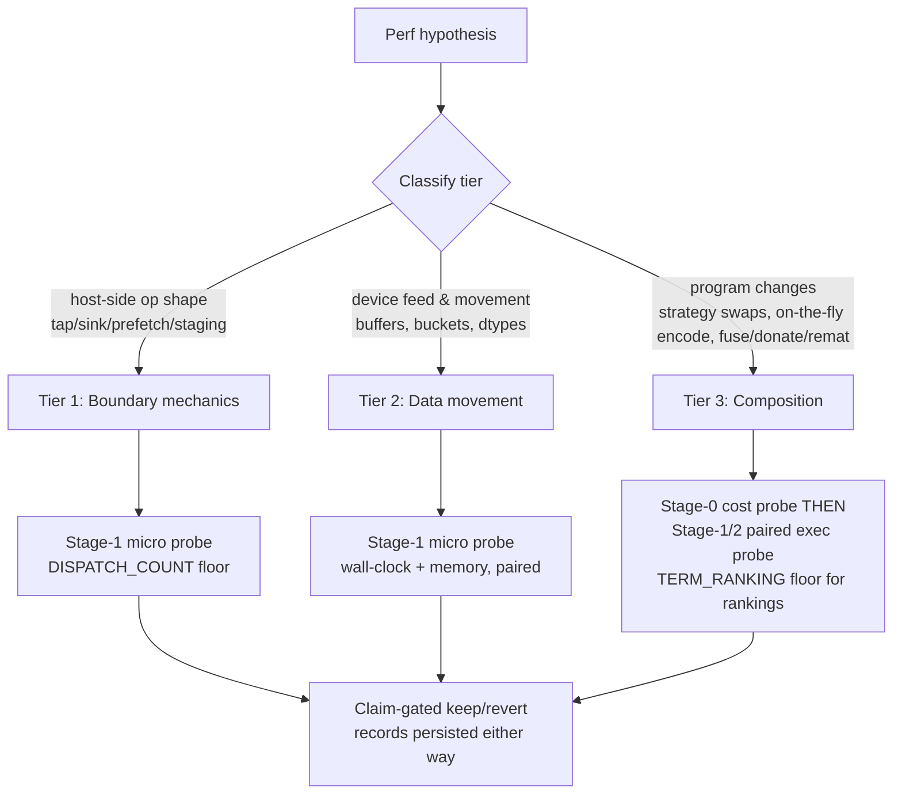

# Scope: JAX/kernel optimization skill (`xtrax-optimizing`) grounded in ProbeRecord discipline

Date: 2026-08-25
Status: DELIVERED -- P1/P2/P3 shipped; user-owned remainders listed in section 7b.
Lineage: extends 260824_upstream-profiling-probe-tooling-from-prolix.md (Phase B/C probe
infra) and prolix's 260817_jax-profiling-optimization-workflow.md (P4 attribution rules).
Sibling skills: `agent_assets/skills/using-xtrax`, `agent_assets/skills/xtrax-probing`.

## 1. Question answered by the survey

"Do we have any kernel / jax-ops optimization utilities now that proberecord is
integrated?" Answer: **measurement yes, optimization no** -- and that asymmetry is
the gap this skill closes.

### What exists today (verify-paths)

| Capability | Owner | Notes |
|---|---|---|
| Stage-0 XLA cost probes (never executes) | `scripts/prof_stage0_tiling_cost.py` | cost_analysis per tiling strategy |
| Stage-1 micro-exec probes + named-scope attribution | `scripts/prof_stage1_tiling_micro.py`, `xtrax.profiling.trace` | two-input attribution (trace + compiled HLO text) |
| ProbeRecord contract + claim classes | `xtrax.profiling.record`, `xtrax.profiling.claims` | STRUCTURAL / DISPATCH_COUNT / TERM_RANKING / END_TO_END, fail-closed |
| Benchmark -> ProbeRecord bridge | `xtrax.profiling.bench`, `benchmarks/conftest.py` | opt-in via `XTRAX_BENCH_RECORD_DIR`; benches declare `xtrax_stage`/`xtrax_n_atoms` |
| Dispatch-count tripwires | `xtrax.devtools.gates.performance` | per-probe `max_compilations`/`max_jit_traces` ceilings + emission |
| Compile-vs-runtime separation | `xtrax.loop.compile_time_clock` | TwoPhaseTiming, `block_until_ready` discipline, AC-27 |
| Tap/Sink/Fuse boundary vocabulary | `xtrax.stages.boundaries`, `executor.py`, `topology.py` | ordered tap => per-step host round trips; Vmap+ordered rejected at plan time |
| Host-side prefetch | `xtrax.engine.io.async_indexed_stream` | asyncio thread-pool prefetch of blocking iterables (host CPU side only) |
| Keyed staging sink | `xtrax.run.zarr_sink.ZarrStagingSink` | io_callback streaming drain pattern |
| Shape bucketing | `xtrax.tiling.bucket` | bounds recompiles for variable-length axes |
| Donation helper (only consumer-facing one) | `xtrax.sparse.inference.sparse_filter_jit` | donate plumbing exists here, nowhere else |
| Scan-based gradient accumulation | `xtrax.training.grad.accumulate_grads` | microbatches via lax.scan; Tier-3 relevant (carry shape, fusion) |

### What does NOT exist

- No optimization *utilities* package: no H2D/double-buffered device feed, no
  on-the-fly feature encoding helpers, no general donate/remat guidance surface.
- No one-hot (or any categorical encode) path at all outside evaluator sanity-test
  fixtures -- nothing to compare materialized vs computed-in-graph.
- No workflow that says *which* optimization class a change belongs to, or what
  evidence each class requires before it may be kept.
- No skill tying these together. `xtrax-probing` covers how to measure; nothing
  covers what to do with the answer.

## 2. Core design: the three-tier taxonomy

The skill's central contribution is a strict classification rule. Every proposed
optimization MUST be classified first; the tier determines the allowed change
surface, the required probe, and the minimum claim class.



### Tier 1 -- Tap/host-side operations (boundary mechanics)

Change surface: how host callbacks fire; never the math.
Contents: ordered vs unordered taps, per-step vs fused sinks, `io_callback`
round-trip accounting (an ordered tap inside a Scan of N steps = N serialized
host round trips -- see `executor.py` docstring), `ZarrStagingSink` batching,
topology constraints (ordered tap forbids Vmap).
Required evidence: Stage-1 probe isolating callback cost; DISPATCH_COUNT must not
regress. Typical claim ceiling: DISPATCH_COUNT (+STRUCTURAL).

### Tier 2 -- Prefetching and data movement

Change surface: when and how arrays reach the device; still not the math.
Contents: `async_indexed_stream` buffer sizing, double-buffering the input
iterator against step time, dtype coercion at load vs in-graph, bucket selection
(`tiling.bucket`) to bound recompiles, pinned-memory placement if ever added.
Required evidence: paired wall-clock Stage-1 probe (feed-starved vs fed pipeline);
must show overlap actually hides latency rather than shifting it. Claim ceiling:
TERM_RANKING within same platform, END_TO_END only via the scale guard.

### Tier 3 -- High-level composition changes

Change surface: the program itself.
Contents: strategy swaps (Vmap <-> SafeMap <-> DedupGather <-> Bucket), on-the-fly
one-hot / categorical encoding inside jit instead of materialized host arrays,
fusion-friendly refactors, `donate_argnums`, remat/checkpoint tradeoffs.
These can change numerics or sharding behavior -- highest risk, highest reward.
Required evidence: Stage-0 cost probe FIRST (cheap structural signal, catches
losing ideas before execution), then paired Stage-1/2 with unanimity guards;
any *ranking* claim requires TERM_RANKING floors (>=2 attributed scopes,
platform/git unanimity). Numerics-parity check mandatory when the change could
alter results (e.g. one-hot float matmul vs integer gather).

## 3. Measurement discipline (the bathos analogy)

Same skeleton the controller/bathos loop already uses, applied to perf work:

1. **Preregister** the hypothesis before probing: expected mechanism, target
   metric, tier, minimum claim class. Stored as the probe driver's declared
   scopes/metrics (sidecar style, mirroring bathos pre-registration).
2. **Baseline first**: no optimization lands without a same-sha baseline record.
3. **One tier per candidate**: never mix a Tier-1 tweak with a Tier-3 rewrite in
   one measured change; attribution becomes meaningless otherwise.
4. **Paired configs**: reuse `claims.paired_configs` unanimity logic
   (platform/device_kind/x64/xla_flags/git_sha).
5. **Fail-closed keeping**: a change without a supporting record is reverted,
   not argued for. `ClaimValidityError` on an unsupported keep-claim is the
   designed outcome, not a nuisance.
6. **Both records persist**: winner AND loser records land in
   `outputs/profiling/` so regressions stay auditable (report.py renders both).

## 4. Proposed skill artifact

```
agent_assets/skills/xtrax-optimizing/
  SKILL.md                 # taxonomy decision table, non-negotiables, quick start
  references/
    tier1-host-boundary.md # tap/sink costs, ordering rules, executor verify-paths
    tier2-data-movement.md # prefetch/bucket/dtype recipes + probe pairings
    tier3-composition.md   # strategy swaps, on-the-fly one-hot, donate/remat
    measurement-protocol.md# preregistration format, probe recipes per tier,
                           # claim-class mapping, keep/revert procedure
```

Triggers: "optimize this jax function", "why is my scan slow", "should this be
on-the-fly", "prefetch", "reduce host sync", "donate", plus cross-refs from
`using-xtrax` (JIT boundary rules section) and `xtrax-probing` (drivers section).

Non-negotiables carried over from `xtrax-probing`: never hand-write record JSON,
never widen a guard to make a claim pass, code wins over skill text (verify-paths).

## 5. New library surface (small, optional, Tier-gated)

Only build utilities the probes justify. Candidates in dependency order:

1. `scripts/prof_stage1_host_boundary.py` -- ordered vs unordered tap cost in a
   Scan; measures the N-round-trip tax directly. (Unlocks Tier 1 evidence.)
2. `scripts/prof_stage1_feed_overlap.py` -- input-iteration overlapped vs
   sequential; quantifies prefetch benefit honestly. (Tier 2.)
3. `scripts/prof_stage0_onehot_cost.py` + stage-1 pair -- materialized one-hot
   array vs `jnp.eye`-free gather/matmul-on-the-fly inside jit: memory + wall
   + parity. (Tier 3 exemplar; doubles as the worked example in the skill.)
4. Possibly later: a `xtrax.perf` package only if >=2 drivers share enough
   scaffolding to justify it (leaf-package rules like `profiling` would apply).

Explicitly out of scope: grain pipeline sharding (deferred Phase 5/6 per
`data/pipeline.py` stub), multi-host sharding strategy work, autotuning sweeps.

## 6. Phasing

- **P0 (this doc)**: approve taxonomy + skill outline. ~0 code.
- **P1**: write the skill shell + Tier-3 exemplar probe pair (#3 above) since
  one-hot is the motivating case. Skill ships with real verify-paths only --
  no aspirational citations.
- **P2**: Tier-1/Tier-2 probe drivers (#1, #2), fill remaining reference docs
  from their results.
- **P3**: wire trigger cross-references from the two existing skills; add a
  performance-gate rubric entry if the drivers earn permanent tripwires.

## 7. Open questions

1. Does Tier-3 parity checking belong in the probe drivers themselves (emit a
   parity metric into the record) or as a separate gate? Leaning: metric in the
   record, gate reads it -- keeps `profiling` leaf-pure.
2. Should losing-candidate records live in the same directory tree (report
   clutter) or a sibling `outputs/profiling/rejected/`? Leaning: sibling dir,
   discover_records already takes explicit paths.
3. Name: `xtrax-optimizing` vs `xtrax-perf`. Existing pair is
   `using-xtrax`/`xtrax-probing`, so gerund form fits the family.

## 7b. Resolution + delivery record (2026-08-25)

Q1 RESOLVED per lean: parity is captured IN-RECORD (`parity_max_abs_diff`
metric) and gated BEFORE measurement -- `prof_stage1_onehot_micro.py` refuses
to emit at all if variants disagree beyond tolerance. Q2 RESOLVED per lean:
losers go to `outputs/profiling/rejected/`; no such records exist yet, the
convention is documented in the skill's measurement-protocol reference. Q3
RESOLVED per lean: `xtrax-optimizing`.

Delivered (commits 7de4ead, d8ae444, 20bdc62, 346daef, 3ad9bcd):
- Skill: SKILL.md + measurement-protocol / tier1 / tier2 / tier3 references,
  every measured claim citing a real driver run (including two honest
  negative/ambiguous findings: CPU one-hot wall ratios unstable across runs;
  async feed overlap 0.70x SLOWER on sub-ms CPU steps).
- Drivers: prof_stage0_onehot_cost.py, prof_stage1_onehot_micro.py,
  prof_stage1_host_boundary.py, prof_stage1_feed_overlap.py -- all emitting
  claim-valid ProbeRecords, all smoke/end-to-end pinned by
  tests/scripts/test_prof_optimizing_drivers.py (11 tests).
- Cross-links from using-xtrax and xtrax-probing; outputs README regeneration
  list extended.

User-owned remainders (not done on purpose):
- Stage-2 GPU re-runs of all three probe families to unlock TERM_RANKING /
  END_TO_END pairs (this machine is CPU-only jaxlib).
- Performance-gate tripwire wiring for these probes. House policy pins
  repo targets to NO dispatch config
  (tests/audit/test_performance_gate.py::test_repo_targets_have_no_dispatch_config);
  enabling ceilings is a policy change requiring Marielle's call.
- Any `xtrax.perf` library package only if future driver count justifies it.
